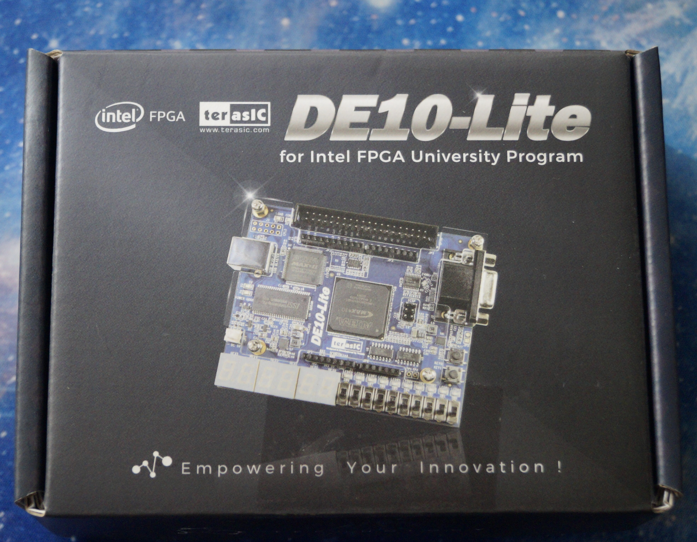
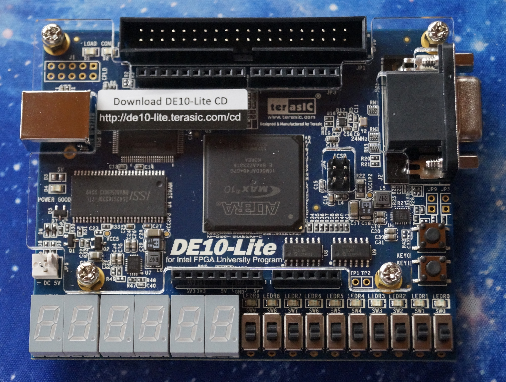
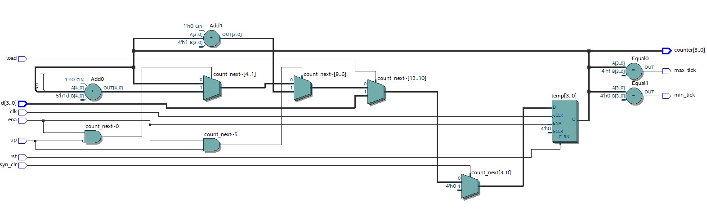
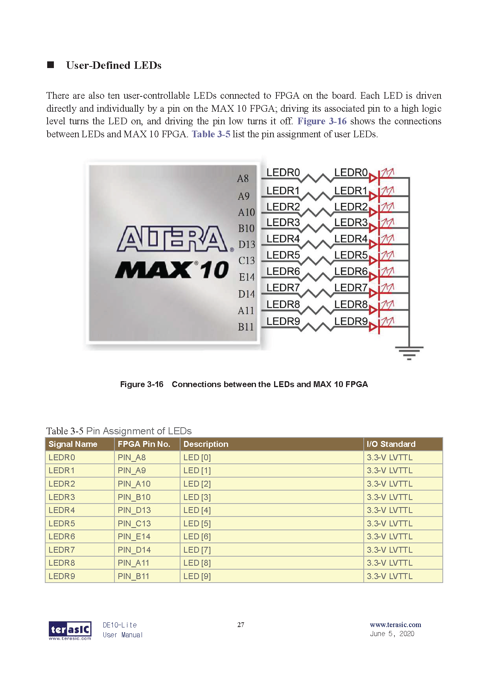
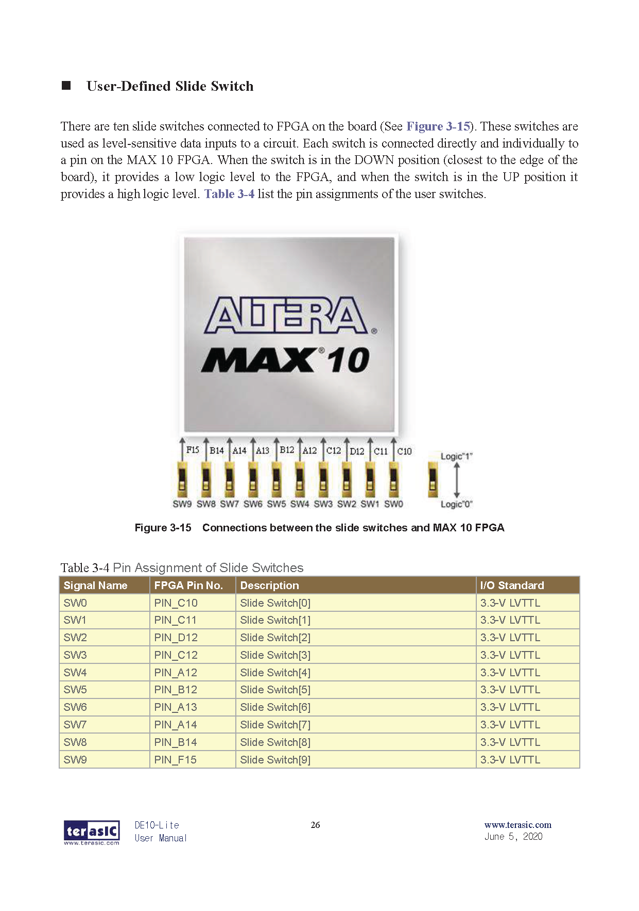

# Binary Counter
For this scenario, an **Binary Counter** is being implemented using **logic gates**, **"instantiation"** and the **"Generate Block"**. Then through the use of **Quartus**, the circuit is going to be coded both in **VHDL** and **Verilog** languages. With the use of Quartus one can check the VHDL or Verilog code implementation does in fact recreate the circuit in question looking at the **RTL model** created by Quartus.

## Block Diagram and Truth Table
<p align="Center">
    <kbd>
        
    </kbd>
</p>

## Hardware used
<p align="center">
    <b>  
        FPGA DE10-Lite  
    </b>
</p>
<p align="center">
    <kbd>
         
    </kbd>
    <kbd>
         
    </kbd>
</p>

## Software used
<p>
    <b>  
        Design Software  
    </b>
</p>
<p align="center">
    <kbd>
         
    </kbd>
<p align ="center" >
    <i>
         Quartus --> Design / Synthesis / FPGA Support.
    </i>
</p>
<p>
    <b>  
        Simulation Software
    </b>
</p>
<p align="center">
    <kbd>
          
    </kbd>
</p>
<p align="center">
  <i>
        Mentor Graphics Questa (Modelsim) --> Functional Timing.
  </i>
</p>

## [VHDL](VHDL_Files)
### VHDL Code Gate Level
For the code, **VHDL 2008** was used in order to allow comments using "--"  
```
LIBRARY IEEE;
USE IEEE.STD_LOGIC_1164.ALL;
USE IEEE.NUMERIC_STD.ALL;
------------------------------------
ENTITY Counter IS
	GENERIC	(	N				:	INTEGER	:= 4);
	PORT 		(	clk			: 	IN		STD_LOGIC;
					rst			: 	IN		STD_LOGIC;
					ena			: 	IN		STD_LOGIC;
					counter		: 	OUT	STD_LOGIC_VECTOR(N-1 DOWNTO 0));
END ENTITY;
------------------------------------
ARCHITECTURE rt1 OF Counter IS
	SIGNAL e1,e2	:	STD_LOGIC;
	SIGNAL e0,e3	:	STD_LOGIC_VECTOR (N-1 DOWNTO 0);

BEGIN

DUT0: ENTITY work.my_dff
PORT MAP (	clk	=>    clk,
				rst	=>    rst,
				ena	=>		ena,
				d		=> 	e3(0),
				q		=>    e0(0));
				
DUT1: ENTITY work.my_dff
PORT MAP (	clk	=>    clk,
				rst	=>    rst,
				ena	=>		e0(0),
				d		=> 	e3(1),
				q		=>    e0(1));
				
DUT2: ENTITY work.my_dff
PORT MAP (	clk	=>    clk,
				rst	=>    rst,
				ena	=>		e1,
				d		=> 	e3(2),
				q		=>    e0(2));

DUT3: ENTITY work.my_dff
PORT MAP (	clk	=>    clk,
				rst	=>    rst,
				ena	=>		e2,
				d		=> 	e3(3),
				q		=>    e0(3));

counter <= e0;
e1 <= e0(1) AND e0(0);
e2 <=	e0(2) AND e0(1) AND e0(0);
e3	<=	NOT e0;
				
END ARCHITECTURE;

```
### VHDL Code Parametrized
For the code, **VHDL 2008** was used in order to allow comments using "--"  
```
--********************** Binary Counter *********************--
--***********************************************************--

--******************* LIBRARY DEFINITION ********************--
--***********************************************************--
LIBRARY IEEE;
USE IEEE.STD_LOGIC_1164.ALL;
USE IEEE.NUMERIC_STD.ALL;

--***************** ENITY = Inputs Outputs ******************--
--***********************************************************--
ENTITY BinCounter IS
	GENERIC	(	N				:	INTEGER	:= 4);
	PORT 		(	clk			: 	IN		STD_LOGIC;
					rst			: 	IN		STD_LOGIC;
					ena			: 	IN		STD_LOGIC;
					syn_clr		:	IN		STD_LOGIC;
					load			:	IN 	STD_LOGIC;
					up				:	IN		STD_LOGIC;
					d				:	IN		STD_LOGIC_VECTOR(N-1 DOWNTO 0);
					max_tick		: 	OUT	STD_LOGIC;
					min_tick		: 	OUT	STD_LOGIC;
					counter		: 	OUT	STD_LOGIC_VECTOR(N-1 DOWNTO 0));
END ENTITY;

--************ INTERCONNECTION BETWEEN SIGNALS **************--
--***********************************************************--
ARCHITECTURE rt1 OF BinCounter IS

--******************* Auxiliary cables **********************--
--***********************************************************--
	CONSTANT ONES			:	UNSIGNED (N-1 DOWNTO 0)	:=	(OTHERS => '1');
	CONSTANT ZEROS			:	UNSIGNED (N-1 DOWNTO 0)	:=	(OTHERS => '0');
	-- SIGNAL count_s		:	INTEGER RANGE 0 to (2**N-1);
	
	SIGNAL count_s			:	UNSIGNED (N-1 DOWNTO 0);
	SIGNAL count_next		:	UNSIGNED (N-1 DOWNTO 0);

--******************** Module Description *******************--
--***********************************************************--
BEGIN


--*********** Parameterized description of Adder ************--
--***********************************************************--

	-- NEXT STATE LOGIC
	count_next	<=		(OTHERS => '0')	WHEN	syn_clr = '1'				   ELSE
							unsigned(d)			WHEN	load='1'							ELSE
							count_s + 1			WHEN	(ena = '1' AND up='1')		ELSE
							count_s - 1			WHEN	(ena = '1' AND up='0')		ELSE
							count_s;
	PROCESS (clk,rst)
		VARIABLE	temp	:	UNSIGNED(N-1 DOWNTO 0);
	BEGIN
		IF(rst = '1') THEN
			temp :=	(OTHERS => '0');
		ELSIF (rising_edge(clk)) THEN
			IF (ena = '1') THEN
				temp := count_next;
			END IF;
		END IF;
		counter <=	STD_LOGIC_VECTOR(temp);
		count_s <=	temp;
	END PROCESS;
	
	--OUTPUT LOGIC
	max_tick <= '1' WHEN count_s = ONES	   ELSE '0';
	min_tick <= '1' WHEN count_s = ZEROS	ELSE '0';


END ARCHITECTURE;

```
[comment]: <> (To make a reference to a parent folder, used when the images are within a parent folder od the Readme.md file one must use ".." as represented below)
### VHDL RTL
**1.** This first image represent the **Binary Counter** in a Gate Level description using **Instantiation**
<p align="center">
    <kbd>
         
    </kbd>
</p>
<p align="center">
    <b>
       RTL Gate Level Instantiation
    </b>
</p>

**2.** This second image represent the **Binary Counter** in a Gate Level description using the **Generate Block**
<p align="center">
    <kbd>
         
    </kbd>
</p>
<p align="center">
    <b>
       RTL Gate Level Generate Block
    </b>
</p>

**3.** Finally describing the **Binary Counter** Parameterized
<p align="center">
    <kbd>
          
    </kbd>
</p>
<p align="center">
    <b>
       RTL Parameterized Description
    </b>
</p>

## [Verilog](Verilog_Files)
## Verilog Code
```

```
## Verilog RTL
**1.** This first image represent the **Binary Counter** in a Gate Level description using **Instantiation**
<p align="center">
    <kbd>
        
    </kbd>
</p>
<p align="center">
    <b>
       RTL Gate Level Instantiation
    </b>
</p>

**2.** This second image represent the **Binary Counter** in a Gate Level description using the **Generate Block**
<p align="center">
    <kbd>
        
    </kbd>
</p>
<p align="center">
    <b>
       RTL Gate Level Generate Block
    </b>
</p>

**3.** Finally describing the **Binary Counter** in a compact way
<p align="center">
    <kbd>
          
    </kbd>
</p>
<p align="center">
    <b>
       RTL Compact Description
    </b>
</p>

## Board Configuration
### Pin assignment

For this project, the inputs of the Full Adder One Bit are going to be the 
**Switches** located in the lower half of the Development Board.

To represent the Outputs of the Full Adder circuit, the red **LEDs**
also present in the board are going to be used.

<p align="center">
    <kbd>
          
    </kbd>
    <kbd>
          
    </kbd>
</p>

To proceed with the assignment of the **Switches** and **LEDs** to the Inputs and
Outputs of the Full Adder circuit inside Quartus. First it is needed to perform a full compilation of the project and
have the proper device "**FPGA/DevBoard**" selected. 

After compilation, refer to the **User Manual** of the FPGA Board to determine
the pins that are hard-wire from the **ALTERA MAX 10 FPGA** to the **Switches** and **LEDs** on the board.

(The User Manual is shown below )

<p align="center">
    <kbd>
        
    </kbd>
    <kbd>    
        
    </kbd>    
</p>

Now, for the next stage, proceed to choose:
* The Switches **SW7 to SW4** for Inputs **A_N**, Switches **SW3 to SW0** for Inputs **B_N**.

* Then for the LEDs choose **LEDR9** for Output **AlwrB_N**, LED **LEDR4** for Output **AeqB_N** and, LED **LEDR0** for Output **AgrtB_N**.

These pins are declared in the Pin PLanner of Quartus:  
***Assignments-->Pin Planner***  
The Pin Planner configuration is shown below

<p align="center">
    <kbd>
         
    </kbd>   
    <kbd>
         
    </kbd>   
</p>

After assigning the Pins for the Inputs and Outputs, perform ***"I/O Assignment Analysis"*** to check for error in the assignments. For the last step perform a Full compilation of all the circuit before uploading it to the board. 

## Board Testing
After doing all the preparation work described before, go to:
***Tools-->Programmer***.  
To program the Development Board with the **.sof** file that has been created inside the root folder of the project.

<p align="center">
    
</p>
