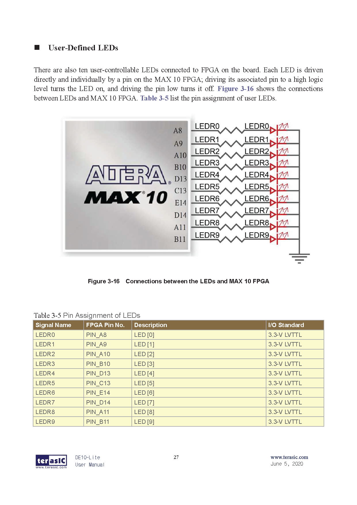

# Comparator N Bits
For this scenario, an **N Bit Comparator** is being implemented using **logic gates**, **"instantiation"** and the **"Generate Block"**. Then through the use of **Quartus**, the circuit is going to be coded both in **VHDL** and **Verilog** languages. With the use of Quartus one can check the VHDL or Verilog code implementation does in fact recreate the circuit in question looking at the **RTL model** created by Quartus.

## Block Diagram and Truth Table
<p align="Center">
    <kbd>
        
    </kbd>
</p>

## Hardware used
<p align="center">
    <b>  
        FPGA DE10-Lite  
    </b>
</p>
<p align="center">
    <kbd>
         
    </kbd>
    <kbd>
         
    </kbd>
</p>

## Software used
<p>
    <b>  
        Design Software  
    </b>
</p>
<p align="center">
    <kbd>
         
    </kbd>
<p align ="center" >
    <i>
         Quartus --> Design / Synthesis / FPGA Support.
    </i>
</p>
<p>
    <b>  
        Simulation Software
    </b>
</p>
<p align="center">
    <kbd>
          
    </kbd>
</p>
<p align="center">
  <i>
        Mentor Graphics Questa (Modelsim) --> Functional Timing.
  </i>
</p>

## [VHDL](VHDL_Files)
### VHDL Code
For the code, **VHDL 2008** was used in order to allow comments using "--"  
```
--******************* Comparator One Bit ********************--
--***********************************************************--

--******************* LIBRARY DEFINITION ********************--
--***********************************************************--
LIBRARY IEEE;
USE IEEE.STD_LOGIC_1164.ALL;
USE IEEE.STD_LOGIC_UNSIGNED.ALL; -- Used to implement the adder
				 -- In a compact description
USE IEEE.STD_LOGIC_MISC.ALL;	 -- Used for vector reduction

--***************** ENITY = Inputs Outputs ******************--
--***********************************************************--
ENTITY CNB IS 
GENERIC	(	Nbits			:	INTEGER := 4); -- Number of bits for
--								  the circuit
PORT
( 	
	A_N, B_N			: IN STD_LOGIC_VECTOR(Nbits-1 DOWNTO 0); 
	AeqB_N, AgrtB_N, AlwrB_N	: OUT STD_LOGIC
-- AeqB -> A = B // AgrtB -> A > B // AlwrB -> A < B
);
END CNB;

--************ INTERCONNECTION BETWEEN SIGNALS **************--
--***********************************************************--
ARCHITECTURE behavioral OF CNB IS

--******************* Auxiliary cables **********************--
--***********************************************************--
	SIGNAL e0, e1, e2	: STD_LOGIC_VECTOR(Nbits-1 DOWNTO 0); 
-- 		 e --> Auxiliary Equations

--******************** Module Description *******************--
--***********************************************************--
BEGIN

--***************** Module Instantiation ********************--
--***********************************************************--

--ComparatorOneBit_0: ENTITY work.COB
--	PORT MAP(	
--				A_in 				=> A_N(0),
--				B_in				=> B_N(0),
--				AlwrB				=> e0(0),
--				AgrtB 			=> e1(0),
--				AeqB 				=> e2(0)
--	);
--	
--ComparatorOneBit_1: ENTITY work.COB
--	PORT MAP(	
--				A_in 				=> A_N(0),
--				B_in				=> B_N(0),
--				AlwrB				=> e0(1),
--				AgrtB 			=> e1(1),
--				AeqB 				=> e2(1)
--	);
--	
--ComparatorOneBit_2: ENTITY work.COB
--	PORT MAP(	
--				A_in 				=> A_N(0),
--				B_in				=> B_N(0),
--				AlwrB				=> e0(2),
--				AgrtB 			=> e1(2),
--				AeqB 				=> e2(2)
--	);
--	
--ComparatorOneBit_3: ENTITY work.COB
--	PORT MAP(	
--				A_in 				=> A_N(0),
--				B_in				=> B_N(0),
--				AlwrB				=> e0(3),
--				AgrtB 			=> e1(3),
--				AeqB 				=> e2(3)
--	);
--	
--AlwrB_N <= OR_REDUCE(e0);	
--AgrtB_N <= OR_REDUCE(e1);
--AeqB_N  <= AND_REDUCE(e2); 

	
--******************** Generate Module ***********************--
--***********************************************************--

-- Designing the generate function for each adder

Gen_proc : for i in 0 to (Nbits-1) generate
ComparatorOneBit: ENTITY work.COB
	PORT MAP(
				A_in 				=> A_N(i),
				B_in				=> B_N(i),
				AlwrB				=> e0(i),
				AgrtB 			=> e1(i),
				AeqB 				=> e2(i)
	);
  end generate Gen_proc;

 -- Assigning 
AlwrB_N <= OR_REDUCE(e0);	
AgrtB_N <= OR_REDUCE(e1);
AeqB_N  <= AND_REDUCE(e2); 

--************* Compact description of Adder ****************--
--***********************************************************--

--AlwrB_N <= '1' WHEN  (A_N < B_N)  ELSE '0';
--AgrtB_N <= '1' WHEN  (A_N > B_N)  ELSE '0';
--AeqB_N  <= '1' WHEN  (A_N = B_N)  ELSE '0';

END ARCHITECTURE behavioral;
```
[comment]: <> (To make a reference to a parent folder, used when the images are within a parent folder od the Readme.md file one must use ".." as represented below)
### VHDL RTL
**1.** This first image represent the **Comparator N Bits** in a Gate Level description using **Instantiation**
<p align="center">
    <kbd>
        
    </kbd>
</p>
<p align="center">
    <b>
       RTL Gate Level Instantiation
    </b>
</p>

**2.** This second image represent the **Comparator N Bits** in a Gate Level description using the **Generate Block**
<p align="center">
    <kbd>
        
    </kbd>
</p>
<p align="center">
    <b>
       RTL Gate Level Generate Block
    </b>
</p>

**3.** Finally describing the **Comparator** in a compact way
<p align="center">
    <kbd>
          
    </kbd>
</p>
<p align="center">
    <b>
       RTL Compact Description
    </b>
</p>

## [Verilog](Verilog_Files)
## Verilog Code
```
//******************* Comparator One Bit ********************--
//***********************************************************--

//**************** Module Inputs and Outputs ****************--
//***********************************************************--
module CNB
#(parameter Nbits = 4) // #Nbits Choose your flavor
 (	
	input [(Nbits-1):0]A_N,B_N,
	
//	output reg AeqB_N, AgrtB_N, AlwrB_N // Use this line in combination with
					    // The "always" block
									
	output AeqB_N, AgrtB_N, AlwrB_N     // Used this line in combination with
					    // The "assign" expression

// AeqB_N -> A = B // AgrtB_N -> A > B // AlwrB_N -> A < B
 );

//******************* Auxiliary cables **********************--
//***********************************************************--

wire [(Nbits-1):0]e0,e1,e2;

//***************** Module Instantiation ********************--
//***********************************************************--

// Instantiating each of the Comparators to be used and 
// Using wires (aux) to interconnect Carry in with Carry out between modules
//
//COB COB0(.A_in(A_N[0]), .B_in(B_N[0]),.AlwrB(e0[0]),.AgrtB(e1[0]),.AeqB(e2[0]));
//COB COB1(.A_in(A_N[1]), .B_in(B_N[1]),.AlwrB(e0[1]),.AgrtB(e1[1]),.AeqB(e2[1]));
//COB COB2(.A_in(A_N[2]), .B_in(B_N[2]),.AlwrB(e0[2]),.AgrtB(e1[2]),.AeqB(e2[2]));
//COB COB3(.A_in(A_N[3]), .B_in(B_N[3]),.AlwrB(e0[3]),.AgrtB(e1[3]),.AeqB(e2[3]));
//
//assign AlwrB_N = | e0;
//assign AgrtB_N = | e1;
//assign AeqB_N = & e2;


//******************** Generate Module ***********************--
//***********************************************************--

// Generate Block
generate
	genvar i; 
	for (i=0; i< Nbits; i=i+1)
	begin: N_bit_Modules // It is necessary to give a name to the generate module/instance
		COB COB(	.A_in(A_N[i]),
					.B_in(B_N[i]),
					.AlwrB(e0[i]),
					.AgrtB(e1[i]), // This "i+1" is done so that each Cin recieve a Cout
					.AeqB(e2[i])
				 );
	end
endgenerate

assign AlwrB_N = | e0;
assign AgrtB_N = | e1;
assign AeqB_N = & e2;


//************* Compact description of Adder ****************--
//***********************************************************--

// Other Options, but only functional when output is of type "reg"     		
//                   	          	
//always @(A_N or B_N)
//	begin: COMPARE
//		AlwrB_N = (A_N < B_N);
//		AgrtB_N = (A_N > B_N);
//		AeqB_N = (A_N == B_N);
//	end
//
//assign AlwrB_N = (A_N < B_N);
//assign AgrtB_N = (A_N > B_N);
//assign AeqB_N = (A_N == B_N);
	
endmodule 
```
## Verilog RTL
**1.** This first image represent the **Comparator N Bits** in a Gate Level description using **Instantiation**
<p align="center">
    <kbd>
        
    </kbd>
</p>
<p align="center">
    <b>
       RTL Gate Level Instantiation
    </b>
</p>

**2.** This second image represent the **Comparator N Bits** in a Gate Level description using the **Generate Block**
<p align="center">
    <kbd>
        
    </kbd>
</p>
<p align="center">
    <b>
       RTL Gate Level Generate Block
    </b>
</p>

**3.** Finally describing the **Comparator** in a compact way
<p align="center">
    <kbd>
          
    </kbd>
</p>
<p align="center">
    <b>
       RTL Compact Description
    </b>
</p>

## Board Configuration
### Pin assignment

For this project, the inputs of the Full Adder One Bit are going to be the 
**Switches** located in the lower half of the Development Board.

To represent the Outputs of the Full Adder circuit, the red **LEDs**
also present in the board are going to be used.

<p align="center">
    <kbd>
          
    </kbd>
    <kbd>
          
    </kbd>
</p>

To proceed with the assignment of the **Switches** and **LEDs** to the Inputs and
Outputs of the Full Adder circuit inside Quartus. First it is needed to perform a full compilation of the project and
have the proper device "**FPGA/DevBoard**" selected. 

After compilation, refer to the **User Manual** of the FPGA Board to determine
the pins that are hard-wire from the **ALTERA MAX 10 FPGA** to the **Switches** and **LEDs** on the board.

(The User Manual is shown below )

<p align="center">
    <kbd>
        
    </kbd>
    <kbd>    
        
    </kbd>    
</p>

Now, for the next stage, proceed to choose:
* The Switches **SW7 to SW4** for Inputs **A_N**, Switches **SW3 to SW0** for Inputs **B_N**.

* Then for the LEDs choose **LEDR9** for Output **AlwrB_N**, LED **LEDR4** for Output **AeqB_N** and, LED **LEDR0** for Output **AgrtB_N**.

These pins are declared in the Pin PLanner of Quartus:  
***Assignments-->Pin Planner***  
The Pin Planner configuration is shown below

<p align="center">
    <kbd>
         
    </kbd>   
    <kbd>
         
    </kbd>   
</p>

After assigning the Pins for the Inputs and Outputs, perform ***"I/O Assignment Analysis"*** to check for error in the assignments. For the last step perform a Full compilation of all the circuit before uploading it to the board. 

## Board Testing
After doing all the preparation work described before, go to:
***Tools-->Programmer***.  
To program the Development Board with the **.sof** file that has been created inside the root folder of the project.

<p align="center">
    
</p>
