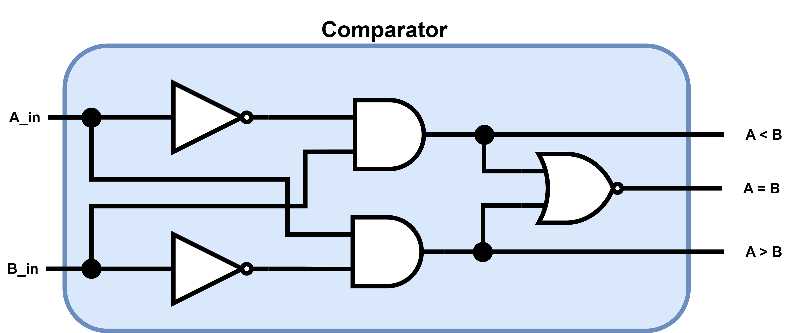
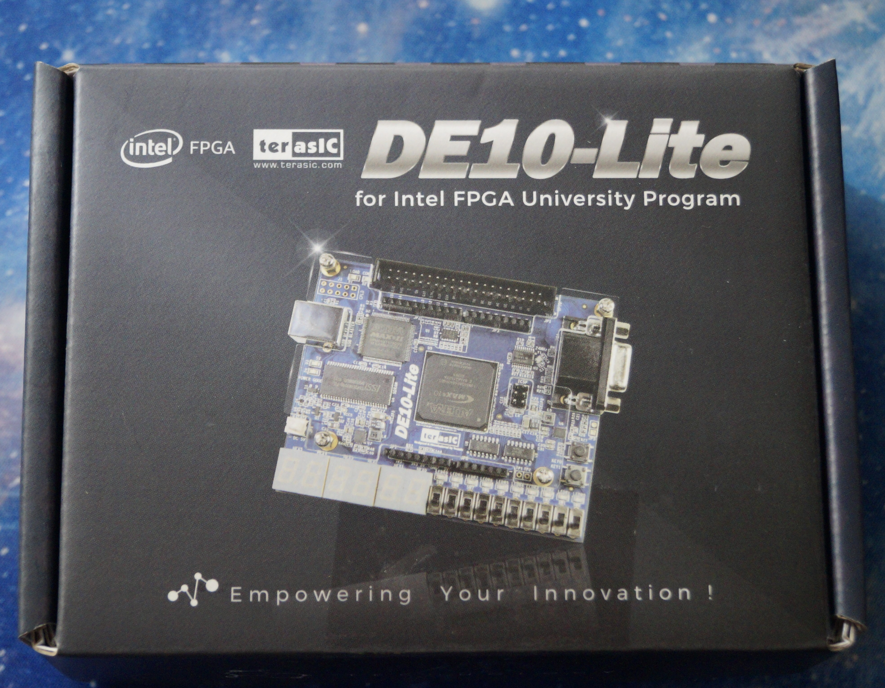

# Comparator One Bit
For this scenario, a Comparator is being implemented using **logic gates**. Then through the use of **Quartus**, the circuit is going to be coded both in **VHDL** and **Verilog** languages. With the use of Quartus one can check the VHDL or Verilog code implementation does in fact recreate the circuit in question looking at the **RTL model** created by Quartus.

## Block Diagram and Truth Table
<p align="Center">
<kbd>

</kbd>
<kbd>
  
</kbd>
</p>

## Hardware used
<p align="center">
    <b>  
        FPGA DE10-Lite  
    </b>
</p>
<p align="center">
<kbd>
 
</kbd>
<kbd>
 
</kbd>
</p>

## Software used
<p>
    <b>  
        Design Software  
    </b>
</p>
<p align="center">
    <kbd>
         
    </kbd>
<p align ="center" >
    <i>
         Quartus --> Design / Synthesis / FPGA Support.
    </i>
</p>
<p>
    <b>  
        Simulation Software
    </b>
</p>
<p align="center">
    <kbd>
          
    </kbd>
</p>
<p align="center">
  <i>
        Mentor Graphics Questa (Modelsim) --> Functional Timing.
  </i>
</p>

## [VHDL](VHDL_Files)
### VHDL Code
For the code, **VHDL 2008** was used in order to allow comments using "--"  
```
--******************* LIBRARY DEFINITION ********************--
--***********************************************************--
LIBRARY IEEE;
USE IEEE.STD_LOGIC_1164.ALL;
USE IEEE.STD_LOGIC_UNSIGNED.ALL; -- Used to implement the adder
				 -- In a compact description

--***************** ENITY = Inputs Outputs ******************--
--***********************************************************--
ENTITY COB IS PORT 
( 
	A_in, B_in				: IN STD_LOGIC; 
	AeqB, AgrtB, AlwrB	: OUT STD_LOGIC 
-- AeqB -> A = B // AgrtB -> A > B // AlwrB -> A < B
);
END COB;

--************ INTERCONNECTION BETWEEN SIGNALS **************--
--***********************************************************--
ARCHITECTURE behavioral OF COB IS

--******************* Auxiliary cables **********************--
--***********************************************************--
	SIGNAL e0, e1	: STD_LOGIC; -- e --> Equations
--	SIGNAL aux		: STD_LOGIC_VECTOR(1 downto 0);

--******************** Module Description *******************--
--***********************************************************--
BEGIN
-- Auxiliary Equations
e0		<= (NOT A_in) AND B_in; -- A < B
e1		<= (NOT B_in) AND A_in; -- A > B

AlwrB		<= e0;
AgrtB		<= e1;
AeqB		<= e0 XNOR e1;			-- A = B

--************* Compact description of Adder ****************--
--***********************************************************--

--AlwrB <= '1' WHEN  (A_in < B_in)  ELSE '0';
--AgrtB <= '1' WHEN  (A_in > B_in)  ELSE '0';
--AeqB 	<= '1' WHEN  (A_in = B_in)  ELSE '0';

END ARCHITECTURE behavioral;
```
[comment]: <> (To make a reference to a parent folder, used when the images are within a parent folder od the Readme.md file one must use ".." as represented below)
### VHDL RTL
**1.** This first image represent the Comparator One Bit in a Gate Level description.
<p align="center">
<kbd>

</kbd>
</p>
<p align="center">
    <b>
       RTL Gate Level
    </b>
</p>

**2.** Finally describing the Comparator in a compact way
<p align="center">
<kbd>
  
</kbd>
</p>
<p align="center">
    <b>
       RTL Compact Description
    </b>
</p>

## [Verilog](Verilog_Files)
## Verilog Code
```
//******************* Comparator One Bit ********************--
//***********************************************************--

//**************** Module Inputs nad Outputs ****************--
//***********************************************************--
module COB
 (	
	input A_in,B_in,
	
//	output reg AeqB, AgrtB, AlwrB // Use this line in combination with
				      // The "always" block				
	output AeqB, AgrtB, AlwrB     // Used this line in combination with
				      // The "assign" expression

// AeqB -> A = B // AgrtB -> A > B // AlwrB -> A < B
 );

//******************* Auxiliary cables **********************--
//***********************************************************--

//wire e0,e1;

//******************** Module Description *******************--
//***********************************************************--

// Auxiliary Equations
assign e0 = (!A_in) & B_in;
assign e1 = (!B_in) & A_in;


// Using the output as a "net" type

assign	 AlwrB = e0;
assign	 AgrtB = e1;
assign	 AeqB = e0 ~^ e1;


//************* Compact description of Adder ****************--
//***********************************************************--

// Other Options, but only functional when output is of type "reg"     		
                   	          	
//always @(A_in or B_in)
//	begin: COMPARE
//		AlwrB = (A_in < B_in);
//		AgrtB = (A_in > B_in);
//		AeqB = (A_in == B_in);
//	end

endmodule 
```
## Verilog RTL
**1.** This first image represent the **Comparator One Bit** in a **Gate Level description**.
<p align="center">
<kbd>

</kbd>
</p>
<p align="center">
    <b>
       RTL Gate Level
    </b>
</p>

**2.** Finally describing the **Comparator** in a **"compact"** way
<p align="center">
<kbd>
  
</kbd>
</p>
<p align="center">
    <b>
       RTL "Compact" Description
    </b>
</p>


## Board Configuration
### Pin assignment

For this project, the inputs of the Full Adder One Bit are going to be the 
**Switches** located in the lower half of the Development Board.

To represent the Outputs of the Full Adder circuit, the red **LEDs**
also present in the board are going to be used.

<p align="center">
    <kbd>
          
    </kbd>
    <kbd>
          
    </kbd>
</p>

To proceed with the assignment of the **Switches** and **LEDs** to the Inputs and
Outputs of the Full Adder circuit inside Quartus. First it is needed to perform a full compilation of the project and
have the proper device "**FPGA/DevBoard**" selected. 

After compilation, refer to the **User Manual** of the FPGA Board to determine
the pins that are hard-wire from the **ALTERA MAX 10 FPGA** to the **Switches** and **LEDs** on the board.

(The User Manual is shown below )

<p align="center">
    <kbd>
        
    </kbd>
    <kbd>    
        
    </kbd>    
</p>

Now, for the next stage, proceed to choose:
* The Switches **SW8 to SW5** for Inputs **A_N**, Switches **SW4 to SW1** for Inputs **B_N**, and Switche **SW0**for Input **Cin**.  

* Then for the LEDs choose **LEDR4 to LEDR1** for Output **Q_N** and LED **LEDR0** for Output **Cout**.

These pins are declared in the Pin PLanner of Quartus:  
***Assignments-->Pin Planner***  
The Pin Planner configuration is shown below

<p align="center">
<kbd>
 
</kbd>   
<kbd>
 
</kbd>   
</p>

After assigning the Pins for the Inputs and Outputs, perform ***"I/O Assignment Analysis"*** to check for error in the assignments. For the last step perform a Full compilation of all the circuit before uploading it to the board. 

## Board Testing
After doing all the preparation work described before, go to:
***Tools-->Programmer***.  
To program the Development Board with the **.sof** file that has been created inside the root folder of the project.

<p align="center">

</p>
