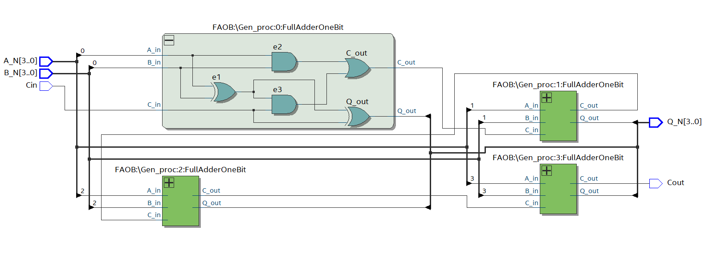

# Full Adder N Bit Cascaded
For this scenario, a **Full Adder** is being implemented using **logic gates**. Then through the use of **Quartus**, the circuit is going to be coded both in **VHDL** and **Verilog**.

Furthermore, using Quartus one can check that the VHDL or Verilog code implement does in fact recreate the circuit in question.

## Block Diagram and Truth Table
<p align="Center">
  
</p>

## Hardware used
<p align="center">
    <b>  
        FPGA DE10-Lite  
    </b>
</p>
<p align="center">
 
 
</p>

## Software used
<p>
    <b>  
        Design Software  
    </b>
</p>
<p align ="center" >
    <i>
         Quartus --> Design / Synthesis / FPGA Support.
    </i>
</p>
<p>
    <b>  
        Simulation Software
    </b>
</p>
<p align="center">
  <i>
        Mentor Graphics Questa (Modelsim) --> Functional Timing.
  </i>
</p>
<p align="center">
 
  
</p>


## [VHDL](VHDL_Files)
### VHDL Code
For the code, **VHDL 2008** was used in order to allow comments using "--"  
```
--******************* LIBRARY DEFINITION ********************--
--***********************************************************--
LIBRARY IEEE;
USE IEEE.STD_LOGIC_1164.ALL;
USE IEEE.STD_LOGIC_UNSIGNED.ALL; -- Used to implement the adder
											-- In a compact description

--***************** ENTITY = Inputs Outputs ******************--
--***********************************************************--
ENTITY FANB IS
	GENERIC	(	Nbits			:	INTEGER := 4);
	PORT 	(		A_N			:	in 	STD_LOGIC_VECTOR(Nbits-1 DOWNTO 0);
					B_N			: 	in 	STD_LOGIC_VECTOR(Nbits-1 DOWNTO 0);
					Cin			: 	in 	STD_LOGIC;
					Cout			: 	out 	STD_LOGIC;
					Q_N			: 	out 	STD_LOGIC_VECTOR(Nbits-1 DOWNTO 0)
				);
END ENTITY FANB;

--************ INTERCONNECTION BETWEEN SIGNALS **************--
--***********************************************************--

ARCHITECTURE behavioral OF FANB IS

--******************* Auxiliary cables **********************--
--***********************************************************--

	SIGNAL Co					: STD_LOGIC_VECTOR(Nbits-1 DOWNTO 0);
	SIGNAL aux					: STD_LOGIC_VECTOR(Nbits downto 0);

BEGIN
--***************** Module Instantiation ********************--
--***********************************************************--

--FullAdderOneBit_0: ENTITY work.FAOB
--	PORT MAP(	
--				A_in 				=> A_N(0),
--				B_in				=> B_N(0),
--				C_in				=> Cin,
--				C_out 				=> Co(0),
--				Q_out 				=> Q_N(0)
--	);
--	
--FullAdderOneBit_1: ENTITY work.FAOB
--	PORT MAP(
--				A_in 				=> A_N(1),
--				B_in 				=> B_N(1),
--				C_in				=> Co(0),
--				C_out			 	=> Co(1),
--				Q_out 				=> Q_N(1)
--	);
--	
--FullAdderOneBit_2: ENTITY work.FAOB
--	PORT MAP(
--				A_in 				=> A_N(2),
--				B_in 				=> B_N(2),
--				C_in 				=> Co(1),
--				C_out 				=> Co(2),
--				Q_out 				=> Q_N(2)
--	);
--	
--FullAdderOneBit_3: ENTITY work.FAOB
--	PORT MAP(
--				A_in 				=> A_N(3),
--				B_in 				=> B_N(3),
--				C_in  				=> Co(2),
--				C_out 				=> Cout,
--				Q_out 				=> Q_N(3)
--	);

--******************** Generte Module ***********************--
--***********************************************************--

---- First assign the Carry in to the auxiliary cable [0]
--aux(0) <= Cin; 
--
---- Designing the generate function for each adder
--
--Gen_proc : for i in 0 to (Nbits-1) generate
--FullAdderOneBit: ENTITY work.FAOB
--	PORT MAP(
--				A_in 				=> A_N(i),
--				B_in 				=> B_N(i),
--				C_in  			=> aux(i),
--				C_out 			=> aux(i+1),
--				Q_out 				=> Q_N(i)
--	);
--  end generate Gen_proc;
--
-- -- Assigning the last bit of the Auxiliary Cable to the Cout_N
--Cout <= aux(Nbits);
	
--****************** Compact Description ********************--
--***********************************************************--

  aux 		<= ('0' & A_N) + ('0' & B_N) + Cin;
  Q_N     <= aux (Nbits-1 downto 0); 	-- Nbits-1 bits
  Cout    <= aux (Nbits);          		-- Nbits bit
	
END ARCHITECTURE behavioral;
```
[comment]: <> (To make a reference to a parent folder, used when the images are within a parent folder od the Readme.md file one must use ".." as represented below)
### VHDL RTL
**1.** This first image represent the Full Adder 4 Bits in a Gate Level description using **Instantiation**
<p align="center">

</p>
<p align="center">
    <b>
       RTL Gate Level Instantiation
    </b>
</p>

**2.** This second image represent the Full Adder N Bits in a Gate Level description using the **Generate Block**
<p align="center">

</p>
<p align="center">
    <b>
       RTL Gate Level Generate Block
    </b>
</p>

**3.** Finally describing the Full Adder in a compact way
<p align="center">
  
</p>
<p align="center">
    <b>
       RTL Compact Description
    </b>
</p>

## [Verilog](Verilog_Files)
## Verilog Code
```
//******************* Full Adder N BitS *********************--
//***********************************************************--

//**************** module = Inputs Outputs ******************--
//***********************************************************--
module FANB                	
#(parameter Nbits = 4) // #Nbits Choose your flavor
(
		input [(Nbits-1):0] A_N, B_N, 
		input Cin, 
		output Cout,		
		output [(Nbits-1):0] Qout_N
		
);
//******************* Auxiliary cables **********************--
//***********************************************************--

wire [2:0]co;			// Used in Module Instantiation
wire [Nbits:0] aux;	// Used in Generate Module

//***************** Module Instantiation ********************--
//***********************************************************--

// Instantiating each of the Full Adders needed and 
// Using wires (co) to interconnect Carry in with Carry out between modules

//FAOB faob0(.A_in(A_N[0]), .B_in(B_N[0]),.C_in(Cin),.Q_out(Qout_N[0]),.C_out(co[0]));
//FAOB faob1(.A_in(A_N[1]), .B_in(B_N[1]),.C_in(co[0]),.Q_out(Qout_N[1]),.C_out(co[1]));
//FAOB faob2(.A_in(A_N[2]), .B_in(B_N[2]),.C_in(co[1]),.Q_out(Qout_N[2]),.C_out(co[2]));
//FAOB faob3(.A_in(A_N[3]), .B_in(B_N[3]),.C_in(co[2]),.Q_out(Qout_N[3]),.C_out(Cout));

//******************** Generte Module ***********************--
//***********************************************************--

// First assign the Carry in to the auxiliary cable [0]
assign aux[0] = Cin;

// Generate Block
generate
	genvar i; 
	for (i=0; i< Nbits; i=i+1)
	begin: N_bit_Modules // It is necessary to give a name to the generate module/instance
		FAOB faob(	.A_in(A_N[i]),
						.B_in(B_N[i]),
						.C_in(aux[i]),
						.C_out(aux[i+1]), // This "i+1" is done so that each Cin recieve a Cout
						.Q_out(Qout_N[i])
					 );
	end
endgenerate

assign Cout = aux[Nbits];

//****************** Compact Description ********************--
//***********************************************************--
//
//assign {Qout_N, Cout} = A_N + B_N + Cin;

endmodule  
```
## Verilog RTL
1. This first image represent the Full Adder 4 Bits in a Gate Level description using **Instantiation**
<p align="center">

</p>
<p align="center">
    <b>
       RTL Gate Level Instantiation
    </b>
</p>

2. This second image represent the Full Adder N Bits in a Gate Level description using the **Generate Block**
<p align="center">

</p>
<p align="center">
    <b>
       RTL Gate Level Generate Block
    </b>
</p>

3. Finally describing the Full Adder in a compact way
<p align="center">
  
</p>
<p align="center">
    <b>
       RTL Compact Description
    </b>
</p>


## Board Configuration
### Pin assignment

For this project, the inputs of the Full Adder One Bit are going to be the 
**Switches** located in the lower half of the Development Board.

To represent the Outputs of the Full Adder circuit, the red **LEDs**
also present in the board are going to be used.

<p align="center">
  
  
</p>

To proceed with the assignment of the **Switches** and **LEDs** to the Inputs and
Outputs of the Full Adder circuit inside Quartus. First it is needed to perform a full compilation of the project and
have the proper device "**FPGA/DevBoard**" selected. 

After compilation, refer to the **User Manual** of the FPGA Board to determine
the pins that are hard-wire from the **ALTERA MAX 10 FPGA** to the **Switches** and **LEDs** on the board.

(The User Manual is shown below )

<p align="center">
    
    
</p>

Now, for the next stage, proceed to choose the Switches **SW2, SW1, SW0** ( *PIN_D12, PIN_C11 and PIN_C10* ) for the Inputs **A_0, B_0 and Cin_0** respectively. Then for the LEDs choose **LEDR1 and LEDR0** ( *PIN_A9 and PIN_A8* ) for the Outputs **Q_0 and Cout_0** respectively.

This pins are declared in the Pin PLanner of Quartus:  
Assignments-->Pin Planner

Then after assigning the Pin to the Inputs and Outputs, perform "I/O Assignment Analysis" to check for error in the assignments. And for the last step perform a Full compilation of all the circuit before uploading it to the board. 

The Pin Planner configuration is shown below

<p align="center">
    
</p>
<p align="center">
  
</p>

## Board Testing
After doing all the preparation work describe before, go to:
Tools-->Programmer. To program the Development Board with the .sof file that has been created inside the root folder of the project.

<p align="center">

</p>

