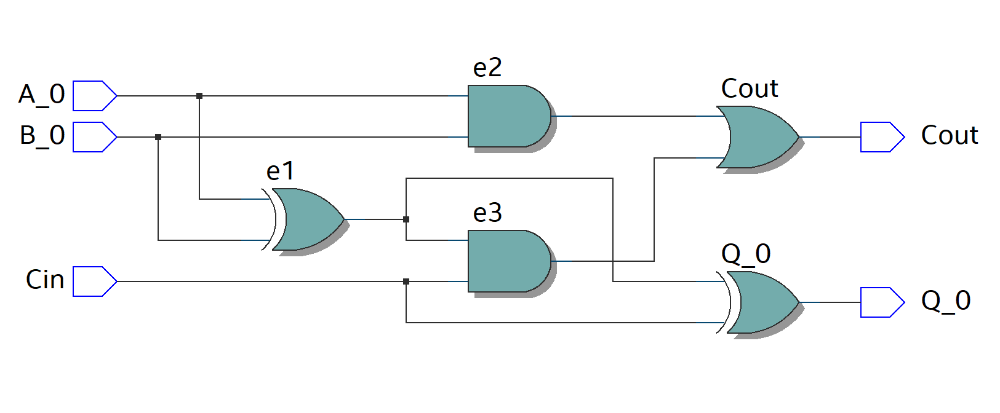
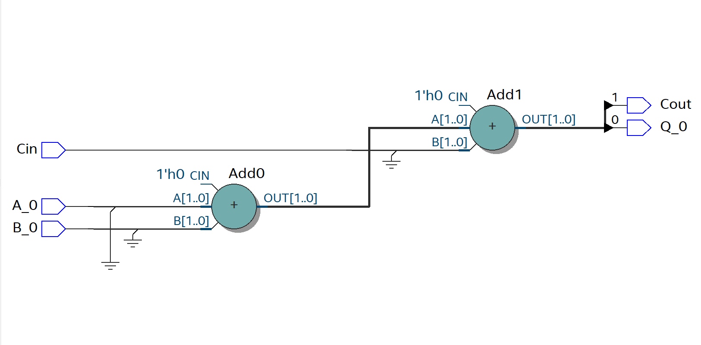

# VHDL
## VHDL Code
For the code, **VHDL 2008** was used in order to allow comments using "--"  
```
--******************* LIBRARY DEFINITION ********************--
--***********************************************************--
LIBRARY IEEE;
USE IEEE.STD_LOGIC_1164.ALL;
USE IEEE.STD_LOGIC_UNSIGNED.ALL; -- Used to implement the adder
				 -- In a compact description

--***************** ENITY = Inputs Outputs ******************--
--***********************************************************--
ENTITY FAOB IS PORT 
( 
	A_0, B_0, Cin	: IN STD_LOGIC; 
	Q_0, Cout		: OUT STD_LOGIC 
);
END FAOB;

--************ INTERCONNECTION BETWEEN SIGNALS **************--
--***********************************************************--
ARCHITECTURE behavioral OF FAOB IS

--**** Auxiliary cables ****--
	SIGNAL e0, e1, e2, e3	: STD_LOGIC;
--	SIGNAL aux		: STD_LOGIC_VECTOR(1 downto 0);

BEGIN

Output_Q_0:   Q_0 <= e1 XOR Cin;

Output_Cout:  Cout <= e3 OR e2;

e1 <= A_0 XOR B_0;
e2 <= A_0 AND B_0;
e3 <= e1 AND Cin;

--*************** Compact description of Adder **************-- 
--  aux <= ('0' & A_0) + ('0' & B_0) + Cin;
--  Q_0     <= aux(0); -- 1st bit
--  Cout    <= aux(1); -- 2nd bit

END ARCHITECTURE behavioral;
```

## VHDL RTL
This first image represent the Full Adder One Bit in a Gate Level description
<p align="center">

</p>
<p align="center">
    <b>
       RTL Gate Level
    </b>
</p>

Now using the library "***USE IEEE.STD_LOGIC_UNSIGNED.ALL;***" one can describe de Full Adder in a compact way, as seen in the next image.
<p align="center">
  
</p>
<p align="center">
    <b>
       RTL Compact Description
    </b>
</p>Code for the Full Adder One Bit in Quartus
