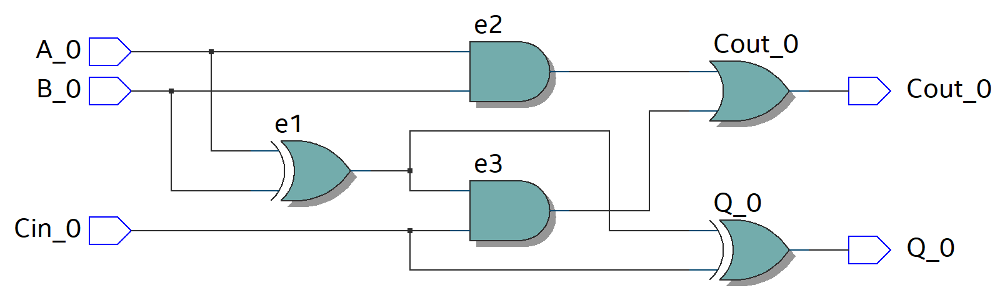

# Full Adder 1 Bit
For this scenario, a **Full Adder** is being implemented using **logic gates**. Then through the use of **Quartus**, the circuit is going to be coded both in **VHDL** and **Verilog**.

Furthermore, using Quartus one can check that the VHDL or Verilog code implement does in fact recreate the circuit in question.

## Block Diagram and Truth Table
<p align="Center">
 
  
</p>

## Hardware used
<p align="center">
    <b>  
        FPGA DE10-Lite  
    </b>
</p>
<p align="center">
 
 
</p>

## Software used
<p>
    <b>  
        Design Software  
    </b>
</p>
<p align ="center" >
    <i>
         Quartus --> Design / Synthesis / FPGA Support.
    </i>
</p>
<p>
    <b>  
        Simulation Software
    </b>
</p>
<p align="center">
  <i>
        Mentor Graphics Questa (Modelsim) --> Functional Timing.
  </i>
</p>
<p align="center">
 
  
</p>

## [VHDL](VHDL_Files)
### VHDL Code
For the code, **VHDL 2008** was used in order to allow comments using "--"  
```
--******************* LIBRARY DEFINITION ********************--
--***********************************************************--
LIBRARY IEEE;
USE IEEE.STD_LOGIC_1164.ALL;
USE IEEE.STD_LOGIC_UNSIGNED.ALL; -- Used to implement the adder
				 -- In a compact description

--***************** ENITY = Inputs Outputs ******************--
--***********************************************************--
ENTITY FAOB IS PORT 
( 
	A_0, B_0, Cin	: IN STD_LOGIC; 
	Q_0, Cout		: OUT STD_LOGIC 
);
END FAOB;

--************ INTERCONNECTION BETWEEN SIGNALS **************--
--***********************************************************--
ARCHITECTURE behavioral OF FAOB IS

--**** Auxiliary cables ****--
	SIGNAL e0, e1, e2, e3	: STD_LOGIC;
--	SIGNAL aux		: STD_LOGIC_VECTOR(1 downto 0);

BEGIN

Output_Q_0:   Q_0 <= e1 XOR Cin;

Output_Cout:  Cout <= e3 OR e2;

e1 <= A_0 XOR B_0;
e2 <= A_0 AND B_0;
e3 <= e1 AND Cin;

--*************** Compact description of Adder **************-- 
--  aux <= ('0' & A_0) + ('0' & B_0) + Cin;
--  Q_0     <= aux(0); -- 1st bit
--  Cout    <= aux(1); -- 2nd bit

END ARCHITECTURE behavioral;
```

### VHDL RTL
This first image represent the Full Adder One Bit in a Gate Level description
<p align="center">

</p>
<p align="center">
    <b>
       RTL Gate Level
    </b>
</p>

Now using the library "***USE IEEE.STD_LOGIC_UNSIGNED.ALL;***" one can describe de Full Adder in a compact way, as seen in the next image.
<p align="center">
  
</p>
<p align="center">
    <b>
       RTL Compact Description
    </b>
</p>

## [Verilog](Verilog_Files)

### Verilog Code
```
//******************* Full Adder One Bit ********************--
//***********************************************************--

//**************** module = Inputs Outputs ******************--
//***********************************************************--
module FAOB
 (	input A_0,B_0,Cin_0,
	output reg Q_0, Cout_0
 );

//******************* Auxiliary cables **********************--
//***********************************************************--
wire e1,e2,e3;

assign e1 = A_0 ^ B_0;
assign e2 = A_0 & B_0;
assign e3 = e1 & Cin_0;

always @ (e1, e2, e3, Cin_0)
	begin
	 Q_0 = e1 ^ Cin_0;
	 Cout_0 = e3 | e2;
	end

//************* Compact description of Adder ****************--
//***********************************************************--
// For the compact descriptions the outputs of the module
// must be of "net" type, thus it is reflected in the code
// changing the outputs Type.

//module FAOB
// (	input A_0,B_0,Cin_0,
//	output Q_0, Cout_0
// );
// 
//assign {Cout_0, Q_0} = A_0 + B_0 + Cin_0;

endmodule 
```
### Verilog RTL
This first image represent the Full Adder One Bit in a Gate Level description
<p align="center">

</p>
<p align="center">
    <b>
       RTL Gate Level
    </b>
</p>

Now using describing the **"Full Adder One Bit"** in a compact way using Verilog, the next image is the output RTL.
<p align="center">
  
</p>
<p align="center">
    <b>
       RTL Compact Description
    </b>
</p>

## Board Configuration
### Pin assignment

For this project, the inputs of the Full Adder One Bit are going to be the 
**Switches** located in the lower half of the Development Board.

To represent the Outputs of the Full Adder circuit, the red **LEDs**
also present in the board are going to be used.

<p align="center">
  
  
</p>

To proceed with the assignment of the **Switches** and **LEDs** to the Inputs and
Outputs of the Full Adder circuit inside Quartus. First it is needed to perform a full compilation of the project and
have the proper device "**FPGA/DevBoard**" selected. 

After compilation, refer to the **User Manual** of the FPGA Board to determine
the pins that are hard-wire from the **ALTERA MAX 10 FPGA** to the **Switches** and **LEDs** on the board.

(The User Manual is shown below )

<p align="center">
    
    
</p>

Now, for the next stage, proceed to choose the Switches **SW2, SW1, SW0** ( *PIN_D12, PIN_C11 and PIN_C10* ) for the Inputs **A_0, B_0 and Cin_0** respectively. Then for the LEDs choose **LEDR1 and LEDR0** ( *PIN_A9 and PIN_A8* ) for the Outputs **Q_0 and Cout_0** respectively.

This pins are declared in the Pin PLanner of Quartus:  
Assignments-->Pin Planner

Then after assigning the Pin to the Inputs and Outputs, perform "I/O Assignment Analysis" to check for error in the assignments. And for the last step perform a Full compilation of all the circuit before uploading it to the board. 

The Pin Planner configuration is shown below

<p align="center">
    
</p>
<p align="center">
  
</p>

## Board Testing
After doing all the preparation work describe before, go to:  
Tools-->Programmer.   
To program the Development Board with the .sof file that has been created inside the root folder of the project.
<p align="center">

</p>

