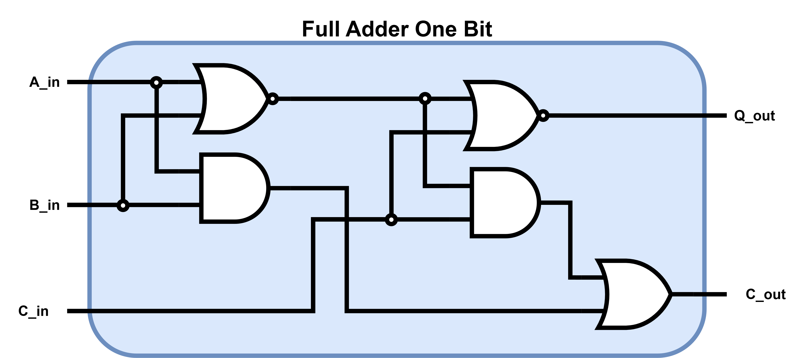
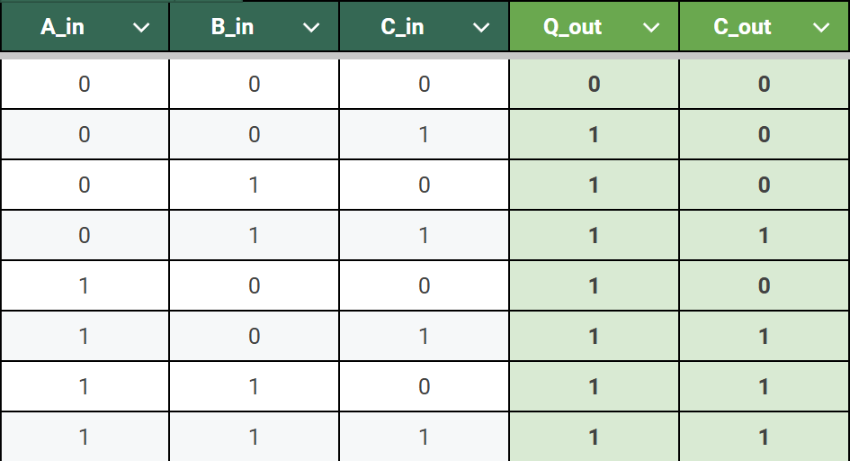
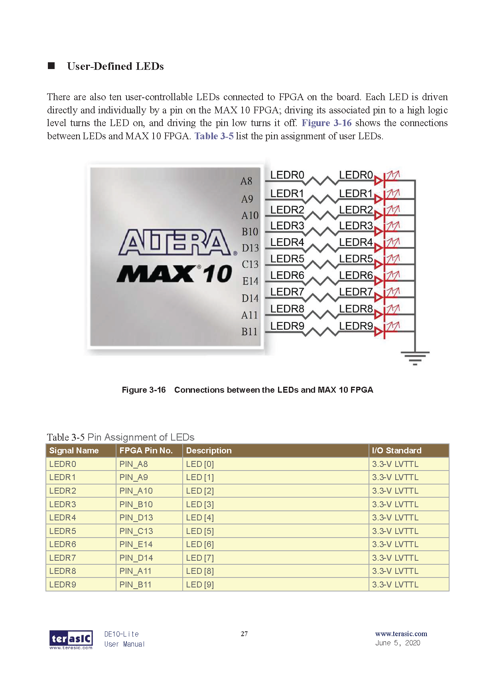
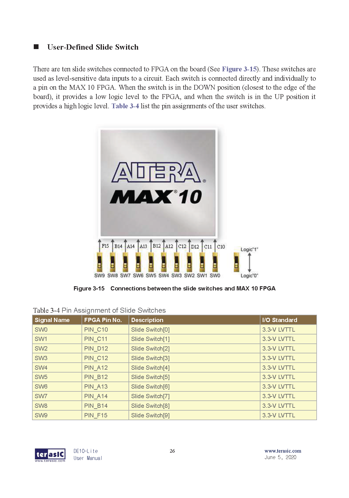
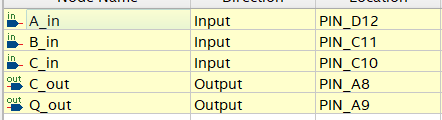
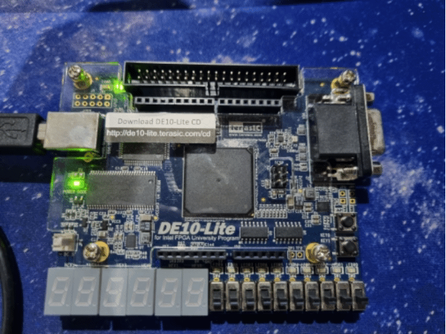

# Full Adder 1 Bit
For this scenario, a **Full Adder** is being implemented using **logic gates**. Then through the use of **Quartus**, the circuit is going to be coded both in **VHDL** and **Verilog**.

Furthermore, using Quartus one can check that the VHDL or Verilog code implement does in fact recreate the circuit in question.

## Block Diagram and Truth Table

 
  

## Hardware used

    <b>  
        FPGA DE10-Lite  
    </b>

 
 

## Software used

    <b>  
        Design Software  
    </b>

    <i>
         Quartus --> Design / Synthesis / FPGA Support.
    </i>

    <b>  
        Simulation Software
    </b>

  <i>
        Mentor Graphics Questa (Modelsim) --> Functional Timing.
  </i>

 
  

## [VHDL](VHDL_Files)
## [Verilog](Verilog_Files)
## Board Configuration
### Pin assignment

For this project the inputs of the Full Adder One Bit are going to be the 
**Switches** located in the lower half of the Development Board.

Furthermore to represent the Outputs of the created circuit the red **LEDs**
also present in the board are going to be used.

  
  

To proceed with the assignment of the **Switches** and **LEDs** to the Inputs and
Outputs. First it is needed to perform a full compilation of the project and
have the proper devices "FPGA" selected. 

After compilation, refer to the **User Manual** of the FPGA Board to determine
the pins that are hard-wire from the **ALTERA MAX 10 FPGA** to the **Switches** and **LEDs** on the board.
(The User Manual is shown below )

    
    

Finally after determining the pins for the Switches and LEDs, proceed to 
choose the Switches SW2, SW1, SW0 (PIN_D12, PIN_C11 and PIN_C10 respectively)
for the Inputs A_0, B_0 and Cin_0 respectively. Then for the LEDs choose
LEDR1 and LEDR0 (PIN_A9 and PIN_A8) fro the Outputs Q_0 and Cout_0 respectively.
The Pin Planner configuration is shown below

    

  

## Board Testing

