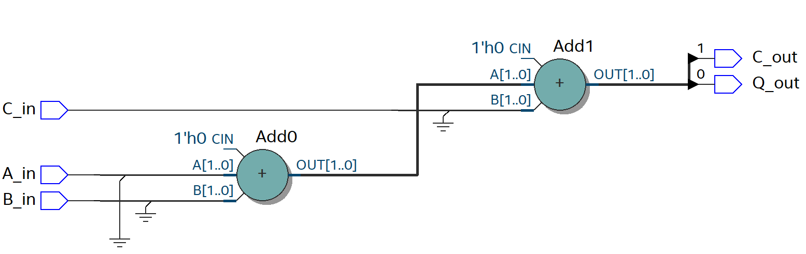

# Full Adder 1 Bit
For this scenario, a **Full Adder** is being implemented using **logic gates**. Then through the use of **Quartus**, the circuit is going to be coded both in **VHDL** and **Verilog** languages. With the use of Quartus one can check the VHDL or Verilog code implementation does in fact recreate the circuit in question looking at the **RTL model** created by Quartus.

## Block Diagram and Truth Table
<p align="Center">
<kbd>
 
  
</kbd>
</p>

## Hardware used
<p align="center">
    <b>  
        FPGA DE10-Lite  
    </b>
</p>
<p align="center">
 
 
</p>

## Software used
<p>
    <b>  
        Design Software  
    </b>
</p>
<p align ="center" >
    <i>
         Quartus --> Design / Synthesis / FPGA Support.
    </i>
</p>
<p>
    <b>  
        Simulation Software
    </b>
</p>
<p align="center">
  <i>
        Mentor Graphics Questa (Modelsim) --> Functional Timing.
  </i>
</p>
<p align="center">
 
  
</p>


## [VHDL](VHDL_Files)
### VHDL Code
For the code, **VHDL 2008** was used in order to allow comments using "--"  
```
--******************* LIBRARY DEFINITION ********************--
--***********************************************************--
LIBRARY IEEE;
USE IEEE.STD_LOGIC_1164.ALL;
USE IEEE.STD_LOGIC_UNSIGNED.ALL; -- Used to implement the adder
				 -- In a compact description

--***************** ENITY = Inputs Outputs ******************--
--***********************************************************--
ENTITY FAOB IS PORT 
( 
	A_in, B_in, C_in	: IN STD_LOGIC; 
	Q_out, C_out		: OUT STD_LOGIC 
);
END FAOB;

--************ INTERCONNECTION BETWEEN SIGNALS **************--
--***********************************************************--
ARCHITECTURE behavioral OF FAOB IS

--******************* Auxiliary cables **********************--
--***********************************************************--
	SIGNAL e0, e1, e2, e3	: STD_LOGIC;
	SIGNAL aux		: STD_LOGIC_VECTOR(1 downto 0);

--******************** Module Description *******************--
--***********************************************************--
BEGIN

Output_Q_out:		Q_out <= e1 XOR C_in;

Output_C_out:		C_out <= e3 OR e2;

e1 <= A_in XOR B_in;
e2 <= A_in AND B_in;
e3 <= e1 AND C_in;


--************* Compact description of Adder ****************--
--***********************************************************--

--  aux <= ('0' & A_in) + ('0' & B_in) + C_in;
--  Q_out    <= aux(0); -- 1st bit
--  C_out    <= aux(1); -- 2nd bit

END ARCHITECTURE behavioral;
```
[comment]: <> (To make a reference to a parent folder, used when the images are within a parent folder od the Readme.md file one must use ".." as represented below)
### VHDL RTL
This first image represent the Full Adder One Bit in a Gate Level description
<p align="center">
<kbd>

</kbd>
</p>
<p align="center">
    <b>
       VHDL GateLevel
    </b>
</p>

Now using the library "***USE IEEE.STD_LOGIC_UNSIGNED.ALL;***" one can describe de Full Adder in a compact way, as seen in the next image.
<p align="center">
<kbd>
  
</kbd>
</p>
<p align="center">
    <b>
       VHDL Compact
    </b>
</p>

## [Verilog](Verilog_Files)
## Verilog Code
```
//******************* Full Adder One Bit ********************--
//***********************************************************--

//**************** Module Inputs nad Outputs ****************--
//***********************************************************--
module FAOB
 (	input A_in,B_in,C_in,
//	output reg Q_out, C_out // Use this line in combination with
				// The "always" block
									
	output Q_out, C_out	// Used this line in combination with
				// The "assign" expression
 );

//******************* Auxiliary cables **********************--
//***********************************************************--

wire e1,e2,e3;

//******************** Module Description *******************--
//***********************************************************--
assign e1 = A_in ^ B_in;
assign e2 = A_in & B_in;
assign e3 = e1 & C_in;

// Using the output as "reg" type
//always @ (e1, e2, e3, C_in)
//	begin
//	 Q_out = e1 ^ C_in;
//	 
//	 C_out = e3 | e2;
//	end

// Using the output as a "net" type
assign	 Q_out = e1 ^ C_in;
assign	 C_out = e3 | e2;


//************* Compact description of Adder ****************--
//***********************************************************--
 
//assign {C_out, Q_out} = A_in + B_in + C_in;

endmodule 
```
## Verilog RTL
This first image represent the Full Adder One Bit in a Gate Level description
<p align="center">
<kbd>

</kbd>
</p>
<p align="center">
    <b>
      Verilog GateLevel 
    </b>
</p>

Now using describing the **"Full Adder One Bit"** in a compact way using Verilog, the next image is the output RTL.
<p align="center">
<kbd>
  
</kbd>  
</p>

<p align="center">
    <b>
       Verilog Compact
    </b>
</p>

## Board Configuration
### Pin assignment

For this project, the inputs of the Full Adder One Bit are going to be the 
**Switches** located in the lower half of the Development Board.

To represent the Outputs of the Full Adder circuit, the red **LEDs**
also present in the board are going to be used.

<p align="center">
  
  
</p>

To proceed with the assignment of the **Switches** and **LEDs** to the Inputs and
Outputs of the Full Adder circuit inside Quartus. First it is needed to perform a full compilation of the project and
have the proper device "**FPGA/DevBoard**" selected. 

After compilation, refer to the **User Manual** of the FPGA Board to determine
the pins that are hard-wire from the **ALTERA MAX 10 FPGA** to the **Switches** and **LEDs** on the board.

(The User Manual is shown below )

<p align="center">
<kbd>
    
    
</kbd>
</p>

Now, for the next stage, proceed to choose:
* The Switches **SW2, SW1, SW0** for Inputs **A_in, B_in** and **C_in** respectively. 

* Then for the LEDs choose **LEDR1 and LEDR0** for the Outputs **Q_out and C_out**.

These pins are declared in the Pin PLanner of Quartus:  
***Assignments-->Pin Planner***  
The Pin Planner configuration is shown below

<p align="center">
<kbd>
    
</kbd>
</p>
<p align="center">
<kbd>
  
</kbd>
</p>

After assigning the Pins for the Inputs and Outputs, perform ***"I/O Assignment Analysis"*** to check for error in the assignments. For the last step perform a Full compilation of all the circuit before uploading it to the board. 
## Board Testing
After doing all the preparation work describe before, go to:
Tools-->Programmer. To program the Development Board with the .sof file that has been created inside the root folder of the project.

<p align="center">

</p>
