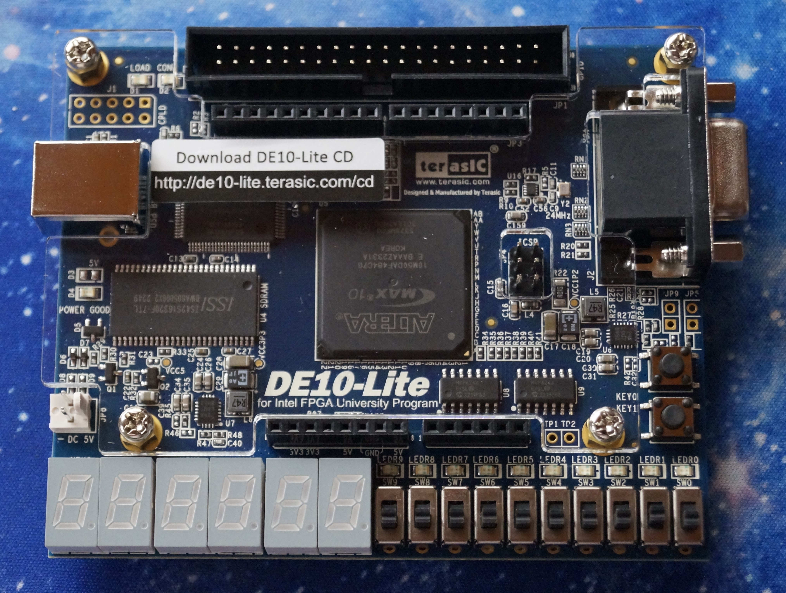

# FIFO (First IN First Out) Buffer
* For this scenario, a **FIFO** that ***Writes*** and ***Reads*** from an specific ***Address*** is being implemented using **Parameterization**.  

 * Then through the use of **Quartus**, the circuit is going to be coded both in **VHDL** and **Verilog** languages.
    * With the use of Quartus one can check the VHDL or Verilog code implementation does in fact recreate the circuit in question looking at the **RTL model** created by Quartus.  

* Finally to verify that the **RAM** is working as expected a **testbench** and simulation in **Questa** is done. 

## Block Diagrams
<p align="center">
    <b>  
        FIFO Block Diagram  
    </b>
</p>
<p align="Center">
    <kbd>
        
    </kbd>
</p>

## Hardware used
<p align="center">
    <b>  
        FPGA DE10-Lite  
    </b>
</p>
<p align="center">
    <kbd>
         
    </kbd>
    <kbd>
         
    </kbd>
</p>

## Software used
<p>
    <b>  
        Design Software  
    </b>
</p>
<p align="center">
    <kbd>
         
    </kbd>
<p align ="center" >
    <i>
         Quartus --> Design / Synthesis / FPGA Support.
    </i>
</p>
<p>
    <b>  
        Simulation Software
    </b>
</p>
<p align="center">
    <kbd>
          
    </kbd>
</p>
<p align="center">
  <i>
        Mentor Graphics Questa (Modelsim) --> Functional Timing.
  </i>
</p>

## [VHDL Dual Port RAM](VHDL_Files)
For the code, **VHDL 2008** was used in order to allow comments using "--"  
```
--*********************** FIFO Buffer ***********************--
--***********************************************************--

--******************* LIBRARY DEFINITION ********************--
--***********************************************************--
LIBRARY IEEE;
USE IEEE.STD_LOGIC_1164.ALL;
USE IEEE.NUMERIC_STD.ALL;

--***************** ENITY = Inputs Outputs ******************--
--***********************************************************--
ENTITY FIFO IS
	GENERIC (DATA_WIDTH: integer :=4;	-- Size of the data to be written in memory
				ARRAY_LENGTH: integer:=8); -- Size of the memory address
	PORT(		
		clk 					: IN STD_LOGIC;
		rst					: IN STD_LOGIC;
		rd_ena				: IN STD_LOGIC;
		wr_ena				: IN STD_LOGIC;
		data_write			: IN STD_LOGIC_VECTOR (DATA_WIDTH-1 DOWNTO 0);
		empty					: OUT STD_LOGIC;
		full					: OUT STD_LOGIC;
		data_read			: OUT STD_LOGIC_VECTOR (DATA_WIDTH-1 DOWNTO 0);
		r_addr_next_s		: OUT STD_LOGIC_VECTOR (ARRAY_LENGTH-1 DOWNTO 0)
);
END ENTITY FIFO;

ARCHITECTURE arch OF FIFO IS

--******************* Auxiliary cables **********************--
--***********************************************************--

	SIGNAL WrAddr_aux 				: STD_LOGIC_VECTOR (ARRAY_LENGTH-1 DOWNTO 0); -- Write Address
	SIGNAL ReAddr_aux					: STD_LOGIC_VECTOR (ARRAY_LENGTH-1 DOWNTO 0); -- Read Address
	SIGNAL Wr_aux						: STD_LOGIC; -- Auxiliary cable for write enable
	SIGNAL full_aux					: STD_LOGIC; -- Auxiliary cable for full buffer signal

	TYPE mem_2d_type IS ARRAY(0 TO 2**ARRAY_LENGTH-1) OF STD_LOGIC_VECTOR(DATA_WIDTH-1 DOWNTO 0);-- declaracion del tamaño/longitud del buffer y del tamaño de datos de cada posicion
	SIGNAL reg_file : mem_2d_type;	
	
BEGIN

--Declaracion logica para habilitar la escritura en el register file
Wr_aux<= (wr_ena AND (NOT full_aux));

--Señal que indica si el buffer esta lleno o no
full 	<= full_aux;

------------------------------------
-- Control Block Buffer FIFO 
control_fifo: ENTITY work.fifo_ctrl
		PORT MAP(
		
		clk 			=>clk,			
		rst			=>rst,
		rd_ena		=>rd_ena,			
		wr_ena		=>wr_ena,			
		empty			=>empty,			
		full			=>full_aux,			
		w_addr		=>WrAddr_aux,			
		r_addr		=>ReAddr_aux,			
		r_addr_next =>r_addr_next_s
		);
		
------------------------------------		
-- Register File Buffer FIFO	
	WRITE_PROCESS: PROCESS (clk, Wr_aux, WrAddr_aux, data_write)
	BEGIN 
		IF (rising_edge(clk)) THEN
		--WRITE
			IF (Wr_aux = '1') THEN
				reg_file(to_integer(unsigned(WrAddr_aux)))<= data_write;
			END IF;
		END IF;
	END PROCESS;

	READ_PROCESS: PROCESS (rd_ena, reg_file, ReAddr_aux)
	BEGIN 
	--READ
		IF (rd_ena='1') THEN
			data_read<=reg_file(to_integer(unsigned(ReAddr_aux)));
		ELSE
			data_read <= (OTHERS => '0');
		END IF;
	END PROCESS;
END ARCHITECTURE arch;
```
[comment]: <> (To make a reference to a parent folder, used when the images are within a parent folder od the Readme.md file one must use ".." as represented below)
### VHDL RTL
**1.** This image represent the **FIFO** being Parameterized
<p align="center">
    <kbd>
          
    </kbd>
</p>
<p align="center">
    <kbd>
          
    </kbd>
</p>
<p align="center">
    <b>
       RTL Parameterized Description
    </b>
</p>

## [Verilog](Verilog_Files)
```

```
### Verilog RTL

**1.** This image represent the **FIFO** being Parameterized
<p align="center">
    <kbd>
          
    </kbd>
</p>
<p align="center">
    <b>
       RTL Parameterized Description
    </b>
</p>

## Test Benches
### Configuration
* For the testbench the **Write** and **Read** instructions are implemented

### TestBench VHDL
```

```
### Testbench Verilog
```

```
## Simulation
<p align="center">
    <b>
       Simulation Results for FIFO
    </b>
</p>
<p align="center">
    <kbd>
          
    </kbd>
</p>
