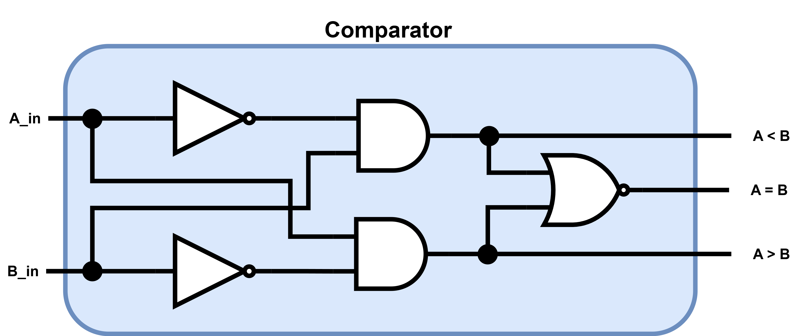

# FPGA-Design
This repository gathers basic knowledge of how to build circuits using **VHDL** and **Verilog** description languages.
The circuits implemented are:
## [Full adder 1 Bit](FullAdderOneBit)

    <a href="FullAdderOneBit/readme.md">
        <kbd>
             
        </kbd>
    </a>

## [Full adder N bits (4 Bits)](FullAdderNBits)

    <a href="FullAdderNBits/readme.md">
        <kbd>
             
        </kbd>
    </a>

## [Comparator 1 Bit](ComparatorOneBit)

    <a href="ComparatorOneBit/readme.md">
        <kbd>
             
        </kbd>
    </a>

## [Comparator N Bits](ComparatorNBits)

    <a href="ComparatorNBits/readme.md">
        <kbd>
             
        </kbd>
    </a>

## [Synchronous Binary Counter](SynchronousBinaryCounter)

    <a href="SynchronousBinaryCounter/readme.md">
        <kbd>
             
        </kbd>
    </a>

    <a href="SynchronousBinaryCounter/readme.md">
        <kbd>
             
        </kbd>
    </a>

    <a href="SynchronousBinaryCounter/readme.md">
        <kbd>
             
        </kbd>
    </a>

## RAM
## FSM
## ALU
## FIFO
## Majority vote
