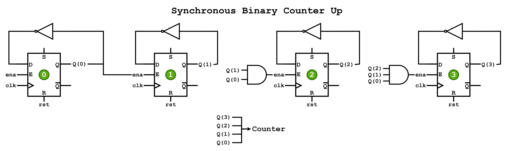
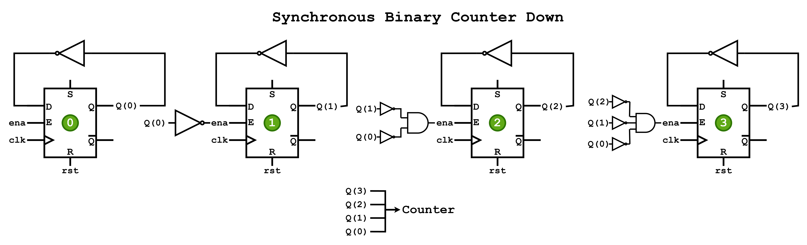
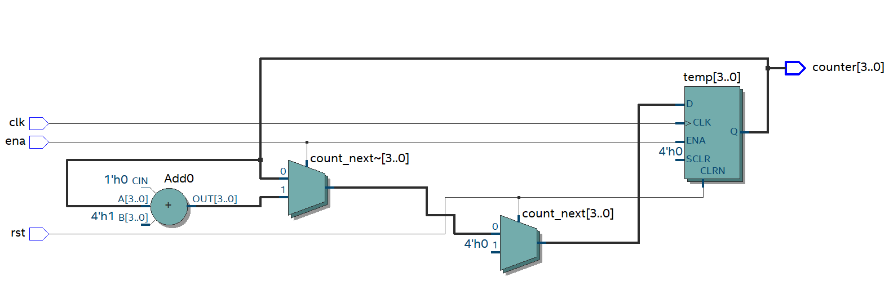
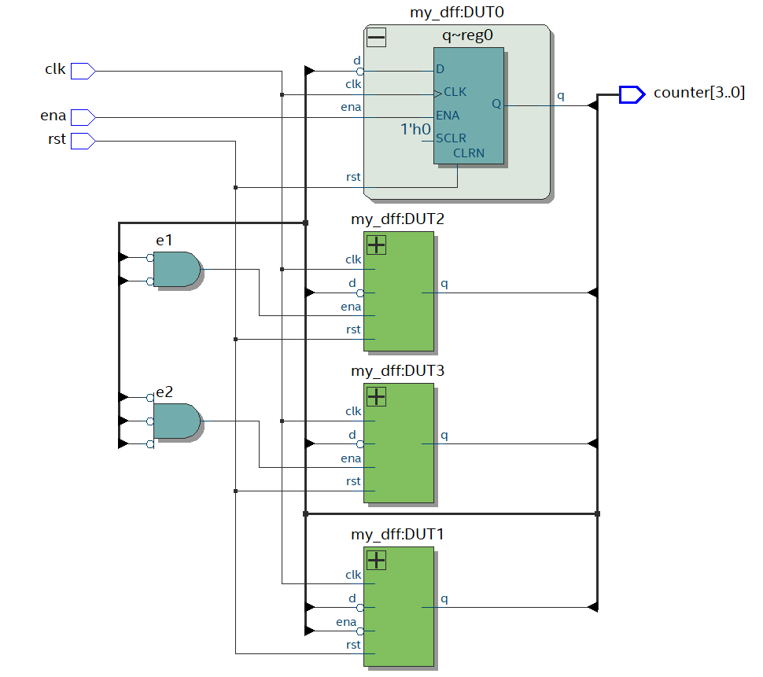
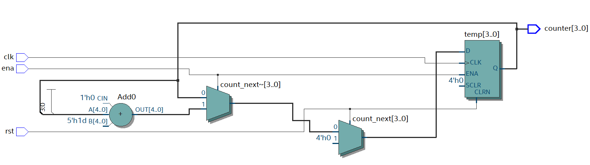
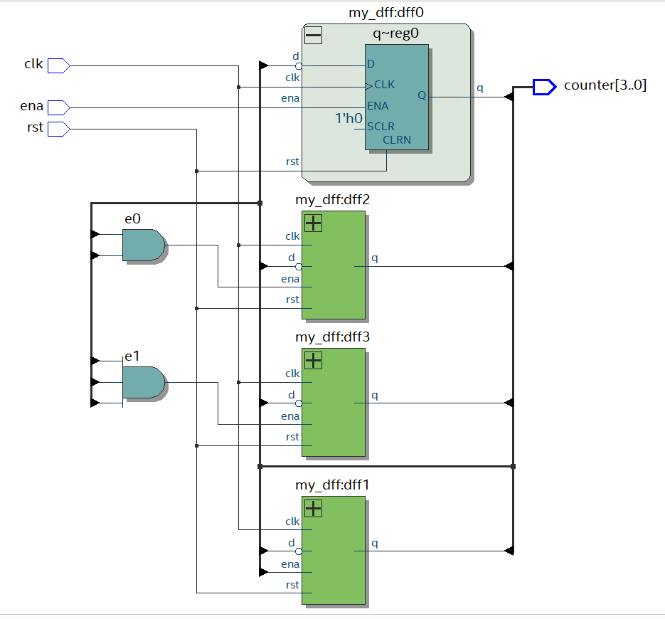
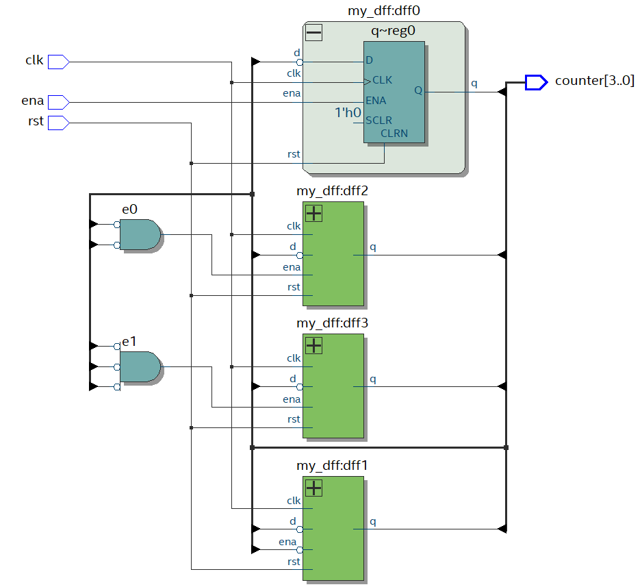
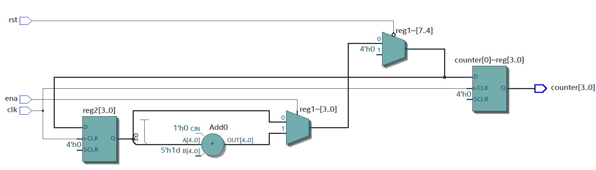
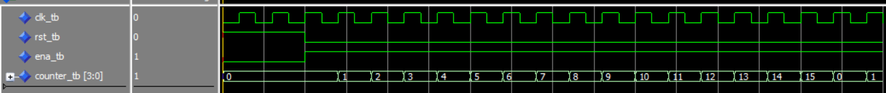
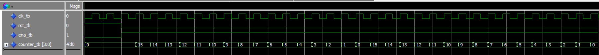

# Synchronous Binary Counter
For this scenario, a **Synchronous Binary Counter** that both *count up* and *counts down*, is being implemented using **logic gates**, **FlipFlops**, **"instantiation"**, and **Parametrization**.  
 Then through the use of **Quartus**, the circuit is going to be coded both in **VHDL** and **Verilog** languages. With the use of Quartus one can check the VHDL or Verilog code implementation does in fact recreate the circuit in question looking at the **RTL model** created by Quartus.

## Block Diagram
<p align="Center">
    <kbd>
        
    </kbd>
</p>

<p align="Center">
    <kbd>
	
    </kbd>
</p>

## Hardware used
<p align="center">
    <b>  
        FPGA DE10-Lite  
    </b>
</p>
<p align="center">
    <kbd>
         
    </kbd>
    <kbd>
         
    </kbd>
</p>

## Software used
<p>
    <b>  
        Design Software  
    </b>
</p>
<p align="center">
    <kbd>
         
    </kbd>
<p align ="center" >
    <i>
         Quartus --> Design / Synthesis / FPGA Support.
    </i>
</p>
<p>
    <b>  
        Simulation Software
    </b>
</p>
<p align="center">
    <kbd>
          
    </kbd>
</p>
<p align="center">
  <i>
        Mentor Graphics Questa (Modelsim) --> Functional Timing.
  </i>
</p>

## [VHDL](VHDL_Files)
### Synchronous Binary Counter Up VHDL Code
For the code, **VHDL 2008** was used in order to allow comments using "--"  
```
--************** Synchronous Binary Counter Up **************--
--***********************************************************--

--******************* LIBRARY DEFINITION ********************--
--***********************************************************--
LIBRARY IEEE;
USE IEEE.STD_LOGIC_1164.ALL;
USE IEEE.NUMERIC_STD.ALL;

--***************** ENITY = Inputs Outputs ******************--
--***********************************************************--
ENTITY SynchBinCount IS
	GENERIC	(	Nbits				:	INTEGER	:= 4);
	PORT 		(	clk			: 	IN		STD_LOGIC;
					rst			: 	IN		STD_LOGIC;
					ena			: 	IN		STD_LOGIC;
					counter		: 	OUT	STD_LOGIC_VECTOR(Nbits-1 DOWNTO 0));
END ENTITY;

--************ INTERCONNECTION BETWEEN SIGNALS **************--
--***********************************************************--
ARCHITECTURE rt1 OF SynchBinCount IS

--******************* Auxiliary cables **********************--
--***********************************************************--
	CONSTANT ONES			:	UNSIGNED (Nbits-1 DOWNTO 0)	:=	(OTHERS => '1');
	CONSTANT ZEROS			:	UNSIGNED (Nbits-1 DOWNTO 0)	:=	(OTHERS => '0');
	-- SIGNAL count_s		:	INTEGER RANGE 0 to (2**N-1);
	
	SIGNAL count_s			:	UNSIGNED (Nbits-1 DOWNTO 0);
	SIGNAL count_next		:	UNSIGNED (Nbits-1 DOWNTO 0);
	
	SIGNAL e1,e2			:	STD_LOGIC;
	SIGNAL e0,e3			:	STD_LOGIC_VECTOR (Nbits-1 DOWNTO 0);

--******************** Module Description *******************--
--***********************************************************--
BEGIN

--***************** Module Instantiation ********************--
--***********************************************************--
DUT0: ENTITY work.my_dff
PORT MAP (	clk	=>    clk,
				rst	=>    rst,
				ena	=>		ena,
				d		=> 	e3(0),
				q		=>    e0(0));
				
DUT1: ENTITY work.my_dff
PORT MAP (	clk	=>    clk,
				rst	=>    rst,
				ena	=>		e0(0),
				d		=> 	e3(1),
				q		=>    e0(1));
				
DUT2: ENTITY work.my_dff
PORT MAP (	clk	=>    clk,
				rst	=>    rst,
				ena	=>		e1,
				d		=> 	e3(2),
				q		=>    e0(2));

DUT3: ENTITY work.my_dff
PORT MAP (	clk	=>    clk,
				rst	=>    rst,
				ena	=>		e2,
				d		=> 	e3(3),
				q		=>    e0(3));

counter <= e0;
e1 <= e0(1) AND e0(0);
e2 <=	e0(2) AND e0(1) AND e0(0);
e3	<=	NOT e0;

--********** Parameterized description of Counter ***********--
--***********************************************************--
--
--	-- NEXT STATE LOGIC
--	count_next	<=		(OTHERS => '0')	WHEN	(rst = '1')		ELSE
--							count_s + 1			WHEN	(ena = '1')		ELSE
--							count_s;
--	PROCESS (clk,rst)
--		VARIABLE	temp	:	UNSIGNED(Nbits-1 DOWNTO 0);
--	BEGIN
--		IF(rst = '1') THEN
--			temp :=	(OTHERS => '0');
--		ELSIF (rising_edge(clk)) THEN
--			IF (ena = '1') THEN
--				temp := count_next;
--			END IF;
--		END IF;
--		counter <=	STD_LOGIC_VECTOR(temp);
--		count_s <=	temp;
--	END PROCESS;


END ARCHITECTURE;
```
[comment]: <> (To make a reference to a parent folder, used when the images are within a parent folder od the Readme.md file one must use ".." as represented below)
### VHDL RTL
**1.** This first image represent the **Synchronous Binary Counter**  using **D-Type FlipFlops** and **Instantiation**
<p align="center">
    <kbd>
         
    </kbd>
</p>
<p align="center">
    <b>
       RTL D-Type FlipFlop Instantiation
    </b>
</p>

**2.** This second image represent the **Synchronous Binary Counter** being Parameterized
<p align="center">
    <kbd>
          
    </kbd>
</p>
<p align="center">
    <b>
       RTL Parameterized Description
    </b>
</p>

### Synchronous Binary Counter Down VHDL Code
For the code, **VHDL 2008** was used in order to allow comments using "--"  
```
--************* Synchronous Binary Counter Down *************--
--***********************************************************--

--******************* LIBRARY DEFINITION ********************--
--***********************************************************--
LIBRARY IEEE;
USE IEEE.STD_LOGIC_1164.ALL;
USE IEEE.NUMERIC_STD.ALL;

--***************** ENITY = Inputs Outputs ******************--
--***********************************************************--
ENTITY SynchBinCountDwn IS
	GENERIC	(	Nbits				:	INTEGER	:= 4);
	PORT 		(	clk			: 	IN		STD_LOGIC;
					rst			: 	IN		STD_LOGIC;
					ena			: 	IN		STD_LOGIC;
					counter		: 	OUT	STD_LOGIC_VECTOR(Nbits-1 DOWNTO 0));
END ENTITY;

--************ INTERCONNECTION BETWEEN SIGNALS **************--
--***********************************************************--
ARCHITECTURE rt1 OF SynchBinCountDwn IS

--******************* Auxiliary cables **********************--
--***********************************************************--
	CONSTANT ONES			:	UNSIGNED (Nbits-1 DOWNTO 0)	:=	(OTHERS => '1');
	CONSTANT ZEROS			:	UNSIGNED (Nbits-1 DOWNTO 0)	:=	(OTHERS => '0');
	-- SIGNAL count_s		:	INTEGER RANGE 0 to (2**N-1);
	
	SIGNAL count_s			:	UNSIGNED (Nbits-1 DOWNTO 0);
	SIGNAL count_next		:	UNSIGNED (Nbits-1 DOWNTO 0);
	
	SIGNAL e1,e2			:	STD_LOGIC;
	SIGNAL e0,e3			:	STD_LOGIC_VECTOR (Nbits-1 DOWNTO 0);

--******************** Module Description *******************--
--***********************************************************--
BEGIN

--***************** Module Instantiation ********************--
--***********************************************************--
DUT0: ENTITY work.my_dff
PORT MAP (	clk	=>    clk,
				rst	=>    rst,
				ena	=>		ena,
				d		=> 	e3(0),
				q		=>    e0(0));
				
DUT1: ENTITY work.my_dff
PORT MAP (	clk	=>    clk,
				rst	=>    rst,
				ena	=>		e3(0),
				d		=> 	e3(1),
				q		=>    e0(1));
				
DUT2: ENTITY work.my_dff
PORT MAP (	clk	=>    clk,
				rst	=>    rst,
				ena	=>		e1,
				d		=> 	e3(2),
				q		=>    e0(2));

DUT3: ENTITY work.my_dff
PORT MAP (	clk	=>    clk,
				rst	=>    rst,
				ena	=>		e2,
				d		=> 	e3(3),
				q		=>    e0(3));

counter <= e0;
e1 <= e3(1) AND e3(0);
e2 <=	e3(2) AND e3(1) AND e3(0);
e3	<=	NOT e0;

--********** Parameterized description of Counter ***********--
--***********************************************************--
--
--	-- NEXT STATE LOGIC
--	count_next	<=		(OTHERS => '0')	WHEN	(rst = '1')		ELSE
--							count_s - 1			WHEN	(ena = '1')		ELSE
--							count_s;
--	PROCESS (clk,rst)
--		VARIABLE	temp	:	UNSIGNED(Nbits-1 DOWNTO 0);
--	BEGIN
--		IF(rst = '1') THEN
--			temp :=	(OTHERS => '0');
--		ELSIF (rising_edge(clk)) THEN
--			IF (ena = '1') THEN
--				temp := count_next;
--			END IF;
--		END IF;
--		counter <=	STD_LOGIC_VECTOR(temp);
--		count_s <=	temp;
--	END PROCESS;


END ARCHITECTURE;
```
[comment]: <> (To make a reference to a parent folder, used when the images are within a parent folder od the Readme.md file one must use ".." as represented below)
### VHDL RTL
**1.** This first image represent the **Synchronous Binary Counter**  using **D-Type FlipFlops** and **Instantiation**
<p align="center">
    <kbd>
         
    </kbd>
</p>
<p align="center">
    <b>
       RTL D-Type FlipFlop Instantiation
    </b>
</p>

**2.** This second image represent the **Synchronous Binary Counter** being Parameterized
<p align="center">
    <kbd>
          
    </kbd>
</p>
<p align="center">
    <b>
       RTL Parameterized Description
    </b>
</p>

## [Verilog](Verilog_Files)
### Synchronous Binary Counter Up Verilog Code
```
//************** Synchronous Binary Counter Up **************--
//***********************************************************--

//**************** Module Inputs and Outputs ****************--
//***********************************************************--
module SynchBinCount
#(parameter Nbits = 4 // #bits
 )
(
   input clk,            				// Clock
   input rst,          					// Reset
   input ena,         			 		// Enable
	output reg [(Nbits-1):0]counter	// Output as 'reg' type
//	output [(Nbits-1):0]counter		//  Output as 'net' type
); 

//******************* Auxiliary cables **********************--
//***********************************************************--

reg [(Nbits-1):0]reg1,reg2;
wire e0,e1;
wire [(Nbits-1):0]qout;

localparam [(Nbits-1):0]ZEROS = 0; 

//***************** Module Instantiation ********************--
//***********************************************************--

my_dff dff0(.clk(clk), .rst(rst),.ena(ena),.d(~qout[0]),.q(qout[0]));
my_dff dff1(.clk(clk), .rst(rst),.ena(qout[0]),.d(~qout[1]),.q(qout[1]));
my_dff dff2(.clk(clk), .rst(rst),.ena(e0),.d(~qout[2]),.q(qout[2]));
my_dff dff3(.clk(clk), .rst(rst),.ena(e1),.d(~qout[3]),.q(qout[3]));


assign e0 = qout[0] & qout[1];
assign e1 = qout[0] & qout[1] & qout[2];

// Using the output signal 'counter' as 'net' type
	//assign counter = qout; 

// Using the output signal 'counter' as 'reg' type
	always @(*)
		begin
			counter = qout;
		end

//****************** Module Parameterization ****************--
//***********************************************************--
//always @(posedge clk)
//begin
//	if(rst==1)
//		reg1 = ZEROS;
//	else if (clk)
//		if (ena == 1)
//			reg1 =  reg2 + 1;
//		else
//			reg1 = reg2;
//			
//	counter	= reg1;
//	reg2 		= reg1;	
//end

endmodule   
```
### Verilog RTL
**1.** This first image represent the **Binary Counter** in a Gate Level description using **Instantiation**
<p align="center">
    <kbd>
        
    </kbd>
</p>
<p align="center">
    <b>
       RTL D-Type FlipFlop Instantiation
    </b>
</p>

**2.** This second image represent the **Synchronous Binary Counter** being Parameterized
<p align="center">
    <kbd>
          
    </kbd>
</p>
<p align="center">
    <b>
       RTL Parameterized Description
    </b>
</p>

### Synchronous Binary Counter Down Verilog Code
```
//************* Synchronous Binary Counter Down *************--
//***********************************************************--

//**************** Module Inputs and Outputs ****************--
//***********************************************************--
module SynchBinCountDwn
#(parameter Nbits = 4 // #bits
 )
(
   input clk,            				// Clock
   input rst,          					// Reset
   input ena,         			 		// Enable
	output reg [(Nbits-1):0]counter	// Output as 'reg' type
//	output [(Nbits-1):0]counter		//  Output as 'net' type
); 

//******************* Auxiliary cables **********************--
//***********************************************************--

reg [(Nbits-1):0]reg1,reg2;
wire e0,e1;
wire [(Nbits-1):0]qout;

localparam [(Nbits-1):0]ZEROS = 0; 

//***************** Module Instantiation ********************--
//***********************************************************--

//my_dff dff0(.clk(clk), .rst(rst),.ena(ena),.d(~qout[0]),.q(qout[0]));
//my_dff dff1(.clk(clk), .rst(rst),.ena(~qout[0]),.d(~qout[1]),.q(qout[1]));
//my_dff dff2(.clk(clk), .rst(rst),.ena(e0),.d(~qout[2]),.q(qout[2]));
//my_dff dff3(.clk(clk), .rst(rst),.ena(e1),.d(~qout[3]),.q(qout[3]));
//
//
//assign e0 = ~qout[0] & ~qout[1];
//assign e1 = ~qout[0] & ~qout[1] & ~qout[2];
//
//// Using the output signal 'counter' as 'net' type
//	//assign counter = qout; 
//
//// Using the output signal 'counter' as 'reg' type
//	always @(*)
//		begin
//			counter = qout;
//		end

//****************** Module Parameterization ****************--
//***********************************************************--
always @(posedge clk)
begin
	if(rst==1)
		reg1 = ZEROS;
	else if (clk)
		if (ena == 1)
			reg1 =  reg2 - 1;
		else
			reg1 = reg2;
			
	counter	= reg1;
	reg2 		= reg1;	
end

endmodule 
```
### Verilog RTL
**1.** This first image represent the **Binary Counter** in a Gate Level description using **Instantiation**
<p align="center">
    <kbd>
        
    </kbd>
</p>
<p align="center">
    <b>
       RTL D-Type FlipFlop Instantiation
    </b>
</p>

**2.** This second image represent the **Synchronous Binary Counter** being Parameterized
<p align="center">
    <kbd>
          
    </kbd>
</p>
<p align="center">
    <b>
       RTL Parameterized Description
    </b>
</p>

## TestBench Configuration
For both the Count Up and Count Down counters, the testbench file is the same.

### TestBench VHDL Code
```
--******************* LIBRARY DEFINITION ********************--
--***********************************************************--
LIBRARY IEEE;
USE IEEE.STD_LOGIC_1164.ALL;
USE IEEE.NUMERIC_STD.ALL;
------------------------------------
ENTITY SynchBinCount_tb IS
	GENERIC	(	Nbits				:	INTEGER	:= 4);
	
	END ENTITY;
------------------------------------
ARCHITECTURE rt1 OF SynchBinCount_tb IS

--********************* Signals to Test *********************--
--***********************************************************--
	SIGNAL	clk_tb      	: STD_LOGIC := '0';
	SIGNAL	rst_tb			: STD_LOGIC;
	SIGNAL	ena_tb			: STD_LOGIC;
	SIGNAL	counter_tb		: STD_LOGIC_VECTOR(Nbits-1 DOWNTO 0);

	
BEGIN
--CLOCK GENERATION:------------------------
	clk_tb <= not clk_tb after 10ns; -- 50MHz clock generation

--************** Instatiating Device Under Test *************--
--***********************************************************--
DeviceUnderTest:	ENTITY work.SynchBinCount
	PORT MAP(	clk		=>	clk_tb,
					rst		=> rst_tb,
					ena		=>	ena_tb,
					counter	=> counter_tb
					);
	
--************** Input Test Signals Generation **************--
--***********************************************************--
signal_generation: PROCESS
	BEGIN
		-- TEST VECTOR 1
		rst_tb	  <= '1';
		ena_tb	  <= '0';
		WAIT FOR 50 ns;
		
		-- TEST VECTOR 2
		rst_tb	  <= '0';
		ena_tb	  <= '1';
		WAIT FOR 200 ns;
		
		-- TEST VECTOR 3
		rst_tb	  <= '0';
		ena_tb	  <= '1';
		WAIT FOR 200 ns;
		
		-- TEST VECTOR 4
		rst_tb	  <= '0';
		ena_tb	  <= '1';
		WAIT FOR 200 ns;
		
		-- TEST VECTOR 5
		rst_tb	  <= '0';
		ena_tb	  <= '1';
		WAIT FOR 200 ns;
		
	END PROCESS;
	
END ARCHITECTURE;
```
### TestBench Verilog Code
```
module SynchBinCount_tb
#(parameter Nbits = 4 // #bits
);
   reg clk_tb;            				// Clock
   reg rst_tb;          				// Reset
   reg ena_tb;         			 		// Enable
	wire [(Nbits-1):0]counter_tb;	// Output as 'reg' type

// 50MHz clock generation
initial clk_tb = 0;
always #10 clk_tb = ~clk_tb;
// Declaring the Device Under Test and also changing the number of bits to be used
SynchBinCount #(.Nbits(Nbits)) DUT(.clk(clk_tb), .rst(rst_tb),.ena(ena_tb),.counter(counter_tb));

	
initial begin

		// TEST VECTOR 1
		rst_tb	= 1;
		ena_tb	= 0;
		#50;
		
		// TEST VECTOR 2
		rst_tb	  <= 0;
		ena_tb	  <= 1;
		#200;
		
		// TEST VECTOR 3
		rst_tb	  <= 0;
		ena_tb	  <= 1;
		#200;
		
		// TEST VECTOR 4
		rst_tb	  <= 0;
		ena_tb	  <= 1;
		#200;	
		
		// TEST VECTOR 5
		rst_tb	  <= 0;
		ena_tb	  <= 1;
		#200;
end
endmodule
```
## Simulation
<p align="center">
    <kbd>
          
    </kbd>
</p>
<p align="center">
    <b>
       Simulation Results for Counter Up
    </b>
</p>

<p align="center">
    <kbd>
          
    </kbd>
</p>
<p align="center">
    <b>
       Simulation Results for Counter Down
    </b>
</p>
