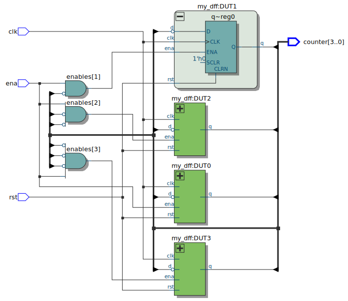
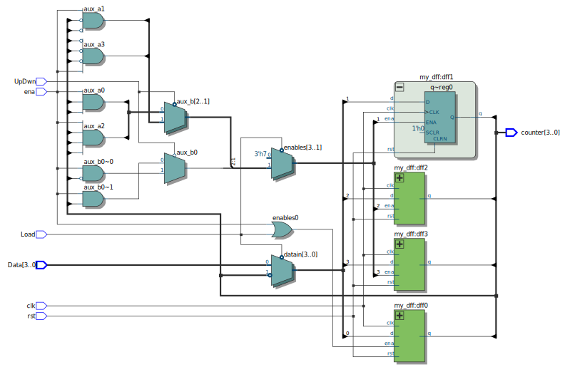

# Synchronous Binary Counters
* For this scenario, multiple **Synchronous Binary Counters** that ***count up***, ***counts down*** and performs a ***Load*** operation, are being implemented using **logic gates**, **FlipFlops**, **instantiation**, and **Parameterization**.  

 * Then through the use of **Quartus**, the circuit is going to be coded both in **VHDL** and **Verilog** languages. With the use of Quartus one can check the VHDL or Verilog code implementation does in fact recreate the circuit in question looking at the **RTL model** created by Quartus.  

* Finally to verify that the counters are working as expected a **testbench** and simulation in **Questa** is done. 

## Block Diagrams
<p align="Center">
    <kbd>
        
    </kbd>
</p>

<p align="Center">
    <kbd>
	
    </kbd>
</p>

<p align="Center">
    <kbd>
	
    </kbd>
</p>

## Hardware used
<p align="center">
    <b>  
        FPGA DE10-Lite  
    </b>
</p>
<p align="center">
    <kbd>
         
    </kbd>
    <kbd>
         
    </kbd>
</p>

## Software used
<p>
    <b>  
        Design Software  
    </b>
</p>
<p align="center">
    <kbd>
         
    </kbd>
<p align ="center" >
    <i>
         Quartus --> Design / Synthesis / FPGA Support.
    </i>
</p>
<p>
    <b>  
        Simulation Software
    </b>
</p>
<p align="center">
    <kbd>
          
    </kbd>
</p>
<p align="center">
  <i>
        Mentor Graphics Questa (Modelsim) --> Functional Timing.
  </i>
</p>

## [VHDL Up - Down - Up/Down/Load](VHDL_Files)
### Synchronous Binary Counter Up (VHDL Code)
For the code, **VHDL 2008** was used in order to allow comments using "--"  
```
--************** Synchronous Binary Counter Up **************--
--***********************************************************--

--******************* LIBRARY DEFINITION ********************--
--***********************************************************--
LIBRARY IEEE;
USE IEEE.STD_LOGIC_1164.ALL;
USE IEEE.NUMERIC_STD.ALL;

--***************** ENITY = Inputs Outputs ******************--
--***********************************************************--
ENTITY SynchBinCountUp IS
	GENERIC	(	Nbits				:	INTEGER	:= 4);	-- # of bits to used
	PORT 		(	clk			: 	IN		STD_LOGIC;		-- Clock Input
					rst			: 	IN		STD_LOGIC;		--	Reset Input
					ena			: 	IN		STD_LOGIC;		--	Enable Input
					counter		: 	OUT	STD_LOGIC_VECTOR(Nbits-1 DOWNTO 0)-- Data Output
				);
END ENTITY;

ARCHITECTURE rt1 OF SynchBinCountUp IS

--******************* Auxiliary cables **********************--
--***********************************************************--
-- Cables used in "Module Instantiation"	
	SIGNAL negate			:	STD_LOGIC_VECTOR (Nbits-1 DOWNTO 0); -- Negative of Output
	SIGNAL enables			:	STD_LOGIC_VECTOR (Nbits-1 DOWNTO 0); -- Enables for each Register
	SIGNAL qout				:	STD_LOGIC_VECTOR (Nbits-1 DOWNTO 0); -- Output Aux Variables
	
-- Cables used in "Module Parameterization"
	CONSTANT ZEROS			:	UNSIGNED (Nbits-1 DOWNTO 0)	:=	(OTHERS => '0'); -- Aux Var -> Set All to Zero
	SIGNAL count_s			:	UNSIGNED (Nbits-1 DOWNTO 0);	-- Aux Var for counting
	SIGNAL count_next		:	UNSIGNED (Nbits-1 DOWNTO 0);	-- Aux Var for counting

BEGIN

--***************** Module Instantiation ********************--
--***********************************************************--
--DUT0: ENTITY work.my_dff
--PORT MAP (	clk	=>    clk,
--				rst	=>    rst,
--				ena	=>		enables(0),
--				d		=> 	negate(0),
--				q		=>    qout(0));
--				
--DUT1: ENTITY work.my_dff
--PORT MAP (	clk	=>    clk,
--				rst	=>    rst,
--				ena	=>		enables(1),
--				d		=> 	negate(1),
--				q		=>    qout(1));
--				
--DUT2: ENTITY work.my_dff
--PORT MAP (	clk	=>    clk,
--				rst	=>    rst,
--				ena	=>		enables(2),
--				d		=> 	negate(2),
--				q		=>    qout(2));
--
--DUT3: ENTITY work.my_dff
--PORT MAP (	clk	=>    clk,
--				rst	=>    rst,
--				ena	=>		enables(3),
--				d		=> 	negate(3),
--				q		=>    qout(3));
--
---- Combinatorial Logic
--counter    <= qout;
--negate	  <= NOT qout;
--
--enables(0) <= ena;
--enables(1) <= qout(0);
--enables(2) <= qout(1) AND qout(0);
--enables(3) <= qout(2) AND qout(1) AND qout(0);

--********** Parameterized description of Counter ***********--
--***********************************************************--
--
	-- NEXT STATE LOGIC
	count_next	<=		(OTHERS => '0')	WHEN	(rst = '1')		ELSE
							count_s + 1			WHEN	(ena = '1')		ELSE
							count_s;
	PROCESS (clk,rst)
		VARIABLE	reg1	:	UNSIGNED(Nbits-1 DOWNTO 0);
	BEGIN
		IF(rst = '1') THEN
			reg1 :=	(OTHERS => '0');
		ELSIF (rising_edge(clk)) THEN
			IF (ena = '1') THEN
				reg1 := count_next;
			END IF;
		END IF;
		counter <=	STD_LOGIC_VECTOR(reg1);
		count_s <=	reg1;
	END PROCESS;


END ARCHITECTURE;
```
[comment]: <> (To make a reference to a parent folder, used when the images are within a parent folder od the Readme.md file one must use ".." as represented below)
### VHDL Up RTL
**1.** This first image represent the **Synchronous Binary Counter**  using **D-Type FlipFlops** and **Instantiation**
<p align="center">
    <kbd>
         
    </kbd>
</p>
<p align="center">
    <b>
       RTL D-Type FlipFlop Instantiation
    </b>
</p>

**2.** This second image represent the **Synchronous Binary Counter** being Parameterized
<p align="center">
    <kbd>
          
    </kbd>
</p>
<p align="center">
    <b>
       RTL Parameterized Description
    </b>
</p>

### Synchronous Binary Counter Down (VHDL Code)
For the code, **VHDL 2008** was used in order to allow comments using "--"  
```
--************* Synchronous Binary Counter Down *************--
--***********************************************************--

--******************* LIBRARY DEFINITION ********************--
--***********************************************************--
LIBRARY IEEE;
USE IEEE.STD_LOGIC_1164.ALL;
USE IEEE.NUMERIC_STD.ALL;

--***************** ENITY = Inputs Outputs ******************--
--***********************************************************--

ENTITY SynchBinCountDwn IS
	GENERIC	(	Nbits				:	INTEGER	:= 4);	-- # of bits to used
	PORT 		(	clk			: 	IN		STD_LOGIC;		-- Clock Input
					rst			: 	IN		STD_LOGIC;		--	Reset Input
					ena			: 	IN		STD_LOGIC;		--	Enable Input
					counter		: 	OUT	STD_LOGIC_VECTOR(Nbits-1 DOWNTO 0)-- Data Output
				);
END ENTITY;

ARCHITECTURE rt1 OF SynchBinCountDwn IS

--******************* Auxiliary cables **********************--
--***********************************************************--
-- Cables used in "Module Instantiation"	
	SIGNAL negate			:	STD_LOGIC_VECTOR (Nbits-1 DOWNTO 0); -- Negative of Output
	SIGNAL enables			:	STD_LOGIC_VECTOR (Nbits-1 DOWNTO 0); -- Enables for each Register
	SIGNAL qout				:	STD_LOGIC_VECTOR (Nbits-1 DOWNTO 0); -- Output Aux Variables
	
-- Cables used in "Module Parameterization"
	CONSTANT ZEROS			:	UNSIGNED (Nbits-1 DOWNTO 0)	:=	(OTHERS => '0'); -- Aux Var -> Set All to Zero
	SIGNAL count_s			:	UNSIGNED (Nbits-1 DOWNTO 0);	-- Aux Var for counting
	SIGNAL count_next		:	UNSIGNED (Nbits-1 DOWNTO 0);	-- Aux Var for counting

BEGIN

--****************** Module Instantiation *******************--
--***********************************************************--
--DUT0: ENTITY work.my_dff
--PORT MAP (	clk	=>    clk,
--				rst	=>    rst,
--				ena	=>		enables(0),
--				d		=> 	negate(0),
--				q		=>    qout(0));
--				
--DUT1: ENTITY work.my_dff
--PORT MAP (	clk	=>    clk,
--				rst	=>    rst,
--				ena	=>		enables(1),
--				d		=> 	negate(1),
--				q		=>    qout(1));
--				
--DUT2: ENTITY work.my_dff
--PORT MAP (	clk	=>    clk,
--				rst	=>    rst,
--				ena	=>		enables(2),
--				d		=> 	negate(2),
--				q		=>    qout(2));
--
--DUT3: ENTITY work.my_dff
--PORT MAP (	clk	=>    clk,
--				rst	=>    rst,
--				ena	=>		enables(3),
--				d		=> 	negate(3),
--				q		=>    qout(3));
--
---- Combinatorial Logic
--counter    <= qout;
--negate	  <= NOT qout;
--
--enables(0) <= ena;
--enables(1) <= negate(0) AND ena;
--enables(2) <= negate(1) AND negate(0) AND ena;
--enables(3) <= negate(2) AND negate(1) AND negate(0) AND ena;

--********** Parameterized description of Counter ***********--
--***********************************************************--
--
	-- NEXT STATE LOGIC
	count_next	<=		(OTHERS => '0')	WHEN	(rst = '1')		ELSE
							count_s - 1			WHEN	(ena = '1')		ELSE
							count_s;
	PROCESS (clk,rst)
		VARIABLE	reg1	:	UNSIGNED(Nbits-1 DOWNTO 0);
	BEGIN
		IF(rst = '1') THEN
			reg1 :=	(OTHERS => '0');
		ELSIF (rising_edge(clk)) THEN
			IF (ena = '1') THEN
				reg1 := count_next;
			END IF;
		END IF;
		counter <=	STD_LOGIC_VECTOR(reg1);
		count_s <=	reg1;
	END PROCESS;


END ARCHITECTURE;
```
[comment]: <> (To make a reference to a parent folder, used when the images are within a parent folder od the Readme.md file one must use ".." as represented below)
### VHDL Down RTL
**1.** This first image represent the **Synchronous Binary Counter**  using **D-Type FlipFlops** and **Instantiation**
<p align="center">
    <kbd>
         
    </kbd>
</p>
<p align="center">
    <b>
       RTL D-Type FlipFlop Instantiation
    </b>
</p>

**2.** This second image represent the **Synchronous Binary Counter** being Parameterized
<p align="center">
    <kbd>
          
    </kbd>
</p>
<p align="center">
    <b>
       RTL Parameterized Description
    </b>
</p>

### Synchronous Binary Counter Up/Down/Load (VHDL Code)
For the code, **VHDL 2008** was used in order to allow comments using "--"  
```
--********* Synchronous Binary Counter UP/Down/Load *********--
--***********************************************************--

--******************* LIBRARY DEFINITION ********************--
--***********************************************************--
LIBRARY IEEE;
USE IEEE.STD_LOGIC_1164.ALL;
USE IEEE.NUMERIC_STD.ALL;

--***************** ENITY = Inputs Outputs ******************--
--***********************************************************--
ENTITY SynchBinCountUPDwnLo IS
	GENERIC	(	Nbits				:	INTEGER	:= 4);	-- # of bits to used
	PORT 		(	clk			: 	IN		STD_LOGIC;		-- Clock Input
					rst			: 	IN		STD_LOGIC;		--	Reset Input
					ena			: 	IN		STD_LOGIC;		--	Enable Input
					Data			: 	IN		STD_LOGIC_VECTOR(Nbits-1 DOWNTO 0); -- Data Input
					UpDwn			: 	IN		STD_LOGIC;		--	Up or Down Selector (Up=1)(Down=0)
					Load			: 	IN		STD_LOGIC;		--	Load Signal
					counter		: 	OUT	STD_LOGIC_VECTOR(Nbits-1 DOWNTO 0)); -- Data Output
END ENTITY;

--************ INTERCONNECTION BETWEEN SIGNALS **************--
--***********************************************************--
ARCHITECTURE rt1 OF SynchBinCountUPDwnLo IS

--******************* Auxiliary cables **********************--
--***********************************************************--

-- Cables used in "Module Instantiation"	
	SIGNAL negate			:	STD_LOGIC_VECTOR (Nbits-1 DOWNTO 0); -- Negative of Output
	SIGNAL aux_a,aux_b	:	STD_LOGIC_VECTOR (Nbits-1 DOWNTO 0); -- Auxiliary Variables
	SIGNAL enables			:	STD_LOGIC_VECTOR (Nbits-1 DOWNTO 0); -- Enables for each Register
	SIGNAL datain			:	STD_LOGIC_VECTOR (Nbits-1 DOWNTO 0); -- Input Aux Variables
	SIGNAL qout				:	STD_LOGIC_VECTOR (Nbits-1 DOWNTO 0); -- Output Aux Variables
	
-- Cables used in "Module Parameterization"
	CONSTANT ZEROS			:	UNSIGNED (Nbits-1 DOWNTO 0)	:=	(OTHERS => '0'); -- Aux Var -> Set All to Zero
	SIGNAL count_s			:	UNSIGNED (Nbits-1 DOWNTO 0);	-- Aux Var for counting
	SIGNAL count_next		:	UNSIGNED (Nbits-1 DOWNTO 0);	-- Aux Var for counting
	
--******************** Module Description *******************--
--***********************************************************--
BEGIN

--***************** Module Instantiation ********************--
--***********************************************************--

--DUT0: ENTITY work.my_dff
--PORT MAP (	clk	=>    clk,
--				rst	=>    rst,
--				ena	=>		enables(0),
--				d		=> 	datain(0),
--				q		=>    qout(0));
--				
--DUT1: ENTITY work.my_dff
--PORT MAP (	clk	=>    clk,
--				rst	=>    rst,
--				ena	=>		enables(1),
--				d		=> 	datain(1),
--				q		=>    qout(1));
--				
--DUT2: ENTITY work.my_dff
--PORT MAP (	clk	=>    clk,
--				rst	=>    rst,
--				ena	=>		enables(2),
--				d		=> 	datain(2),
--				q		=>    qout(2));
--
--DUT3: ENTITY work.my_dff
--PORT MAP (	clk	=>    clk,
--				rst	=>    rst,
--				ena	=>		enables(3),
--				d		=> 	datain(3),
--				q		=>    qout(3));
--
---- Combinatorial Logic
--aux_a(0)	<=	qout(0) AND qout(1) AND ena;
--aux_a(1)	<=	negate(0) AND negate(1) AND ena;
--aux_a(2)	<=	(qout(0) AND qout(1) AND qout(2) AND ena);
--aux_a(3)	<=	(negate(0) AND negate(1) AND negate(2) AND ena);
--
---- Output			
--counter <= qout;
--
---- Negative of output
--negate	<=	NOT qout;
--
---- Data to all registers
--datain	<=	Data		WHEN Load = '1'	ELSE
--			negate;
--			
---- Logic Gates to enable Up/Down count on Registers			
--aux_b(0)		<= (qout(0) AND ena) 	WHEN UpDwn = '1'	ELSE	
--					(negate(0) AND ena);
--					
--aux_b(1)		<= aux_a(0)			WHEN UpDwn = '1'	ELSE
--					aux_a(1);
--		
--aux_b(2)		<= aux_a(2)			WHEN UpDwn = '1'	ELSE
--					aux_a(3);
--					
---- Enables for each of the registers
--enables(0)	<= Load OR ena;
--
--enables(1)	<= '1'			WHEN Load = '1'	ELSE
--					aux_b(0);
--
--enables(2)	<= '1'			WHEN Load = '1'	ELSE
--					aux_b(1);
--			
--enables(3)	<= '1'			WHEN Load = '1'	ELSE
--					aux_b(2);
					
--********** Parameterized description of Counter ***********--
--***********************************************************--
--
	-- NEXT STATE LOGIC
	count_next	<=		(OTHERS => '0')	WHEN	(rst = '1')							ELSE
							UNSIGNED(Data)		WHEN	(ena = '1' AND Load = '1')		ELSE
							count_s + 1			WHEN	(ena = '1' AND UpDwn = '1')	ELSE
							count_s - 1			WHEN	(ena = '1' AND UpDwn = '0')	ELSE
							count_s;
	PROCESS (clk,rst)
		VARIABLE	reg1	:	UNSIGNED(Nbits-1 DOWNTO 0);
	BEGIN
		IF(rst = '1') THEN
			reg1 :=	(OTHERS => '0');
		ELSIF (rising_edge(clk)) THEN
			IF (ena = '1') THEN
				reg1 := count_next;
			END IF;
		END IF;
		counter <=	STD_LOGIC_VECTOR(reg1);
		count_s <=	reg1;
	END PROCESS;


END ARCHITECTURE;
```
[comment]: <> (To make a reference to a parent folder, used when the images are within a parent folder od the Readme.md file one must use ".." as represented below)
### VHDL Up/Down/Load RTL
**1.** This first image represent the **Synchronous Binary Counter**  using **D-Type FlipFlops** and **Instantiation**
<p align="center">
    <kbd>
         
    </kbd>
</p>
<p align="center">
    <b>
       RTL D-Type FlipFlop Instantiation
    </b>
</p>

**2.** This second image represent the **Synchronous Binary Counter** being Parameterized
<p align="center">
    <kbd>
          
    </kbd>
</p>
<p align="center">
    <b>
       RTL Parameterized Description
    </b>
</p>

## [Verilog](Verilog_Files)
### Synchronous Binary Counter Up Verilog Code
```
//************** Synchronous Binary Counter Up **************--
//***********************************************************--

//**************** Module Inputs and Outputs ****************--
//***********************************************************--
module SynchBinCountUp
#(parameter Nbits = 4 							// # of bits to used
 )
(
   input clk,            						// Clock Input
   input rst,          							// Reset Input
   input ena,         			 				// Enable Input
	output reg [(Nbits-1):0]counter			// Data Output
); 

//******************* Auxiliary cables **********************--
//***********************************************************--

// Cables used in "Module Instantiation"
reg enables0,enables1,enables2,enables3;	// Enables for each Register
wire qout0,qout1,qout2,qout3;					// Ouput Aux Variables

// Cables used in "Module Parameterization"
localparam [(Nbits-1):0]ZEROS = 0; 			// Aux Var -> Set All to Zero
reg [(Nbits-1):0]Count_next,Count_aux;		// Aux Var for counting
reg [(Nbits-1):0]reg1;							// Aux var store actual value

//***************** Module Instantiation ********************--
//***********************************************************--

//my_dff dff0(.clk(clk), .rst(rst),.ena(enables0),.d(~qout0),.q(qout0));
//my_dff dff1(.clk(clk), .rst(rst),.ena(enables1),.d(~qout1),.q(qout1));
//my_dff dff2(.clk(clk), .rst(rst),.ena(enables2),.d(~qout2),.q(qout2));
//my_dff dff3(.clk(clk), .rst(rst),.ena(enables3),.d(~qout3),.q(qout3));
//
//always @(*)
//	begin
//	// Output
//		counter = {qout3,qout2,qout1,qout0};
//		
//	// Combinatorial Logic
//		enables0 = ena;
//		enables1 = qout0;
//		enables2 = qout0 & qout1;
//		enables3 = qout0 & qout1 & qout2;
//	end

//****************** Module Parameterization ****************--
//***********************************************************--
always @(*)
begin
	if(rst==1)
		Count_next = ZEROS;
	else if (ena)
		Count_next = Count_aux + 1'b1;
	else
		Count_next = Count_aux;
		
end

always @(posedge clk, posedge rst)
begin
	if(rst)
		reg1 = ZEROS;
	else if (clk)
		if (ena)
				reg1 =  Count_next;		
	counter		= reg1;
	Count_aux 	= reg1;	
end

endmodule 
```
### Verilog RTL
**1.** This first image represent the **Binary Counter** in a Gate Level description using **Instantiation**
<p align="center">
    <kbd>
        
    </kbd>
</p>
<p align="center">
    <b>
       RTL D-Type FlipFlop Instantiation
    </b>
</p>

**2.** This second image represent the **Synchronous Binary Counter** being Parameterized
<p align="center">
    <kbd>
          
    </kbd>
</p>
<p align="center">
    <b>
       RTL Parameterized Description
    </b>
</p>

### Synchronous Binary Counter Down Verilog Code
```
//************* Synchronous Binary Counter Down *************--
//***********************************************************--

//**************** Module Inputs and Outputs ****************--
//***********************************************************--
module SynchBinCountDwn
#(parameter Nbits = 4 							// # of bits to used
 )
(
   input clk,            						// Clock Input
   input rst,          							// Reset Input
   input ena,         			 				// Enable Input
	output reg [(Nbits-1):0]counter			// Data Output
); 

//******************* Auxiliary cables **********************--
//***********************************************************--

// Cables used in "Module Instantiation"
reg enables0,enables1,enables2,enables3;	// Enables for each Register
wire qout0,qout1,qout2,qout3;					// Ouput Aux Variables

// Cables used in "Module Parameterization"
localparam [(Nbits-1):0]ZEROS = 0; 			// Aux Var -> Set All to Zero
reg [(Nbits-1):0]Count_next,Count_aux;		// Aux Var for counting
reg [(Nbits-1):0]reg1;							// Aux var store actual value

//***************** Module Instantiation ********************--
//***********************************************************--

//my_dff dff0(.clk(clk), .rst(rst),.ena(enables0),.d(~qout0),.q(qout0));
//my_dff dff1(.clk(clk), .rst(rst),.ena(enables1),.d(~qout1),.q(qout1));
//my_dff dff2(.clk(clk), .rst(rst),.ena(enables2),.d(~qout2),.q(qout2));
//my_dff dff3(.clk(clk), .rst(rst),.ena(enables3),.d(~qout3),.q(qout3));
//
//always @(*)
//	begin
//	
//	// Output
//		counter = {qout3,qout2,qout1,qout0};
//		
//	// Combinatorial Logic
//		enables0 = ena;
//		enables1 = ~qout0 & ena;
//		enables2 = ~qout0 & ~qout1 & ena;
//		enables3 = ~qout0 & ~qout1 & ~qout2 & ena;
//	end

//****************** Module Parameterization ****************--
//***********************************************************--
always @(*)
begin
	if(rst==1)
		Count_next = ZEROS;
	else if (ena)
		Count_next = Count_aux - 1'b1;
	else
		Count_next = Count_aux;
		
end

always @(posedge clk, posedge rst)
begin
	if(rst)
		reg1 = ZEROS;
	else if (clk)
		if (ena)
				reg1 =  Count_next;		
	counter		= reg1;
	Count_aux 	= reg1;	
end

endmodule 
```
### Verilog RTL
**1.** This first image represent the **Binary Counter** in a Gate Level description using **Instantiation**
<p align="center">
    <kbd>
        
    </kbd>
</p>
<p align="center">
    <b>
       RTL D-Type FlipFlop Instantiation
    </b>
</p>

**2.** This second image represent the **Synchronous Binary Counter** being Parameterized
<p align="center">
    <kbd>
          
    </kbd>
</p>
<p align="center">
    <b>
       RTL Parameterized Description
    </b>
</p>

### Synchronous Binary Counter Up/Down/Load Verilog Code
```
//********* Synchronous Binary Counter Up/Down/Load *********--
//***********************************************************--

//**************** Module Inputs and Outputs ****************--
//***********************************************************--
module SynchBinCountUpDwnLo
#(parameter Nbits = 4 							// #bits
 )
(
   input clk,            						// Clock
   input rst,          							// Reset
   input ena,         			 				// Enable
   input [(Nbits-1):0] Data,   				// Data input
   input UpDwn,          						// UpDwn = 1 Count Up
														//	UpDwn = 1 Count Down
   input Load,										//	Signal to load the registers
	output reg [(Nbits-1):0]counter			// Output as 'reg' type
); 

//******************* Auxiliary cables **********************--
//***********************************************************--

// Cables used in "Module Instantiation"
reg datain0,datain1,datain2,datain3;		// Input Aux Variables
reg enables0,enables1,enables2,enables3;	// Enables for each Register
wire qout0,qout1,qout2,qout3;					// Ouput Aux Variables
reg aux_a0,aux_a1,aux_a2,aux_a3;				// Auxiliary Variables
reg aux_b0,aux_b1,aux_b2;						// Auxiliary Variables

// Cables used in "Module Parameterization"
localparam [(Nbits-1):0]ZEROS = 0; 			// Aux Var -> Set All to Zero
reg [(Nbits-1):0]Count_next,Count_aux;		// Aux Var for counting
reg [(Nbits-1):0]reg1;							// Aux var store actual value


//***************** Module Instantiation ********************--
//***********************************************************--

//my_dff dff0(.clk(clk), .rst(rst),.ena(enables0),.d(datain0),.q(qout0));
//my_dff dff1(.clk(clk), .rst(rst),.ena(enables1),.d(datain1),.q(qout1));
//my_dff dff2(.clk(clk), .rst(rst),.ena(enables2),.d(datain2),.q(qout2));
//my_dff dff3(.clk(clk), .rst(rst),.ena(enables3),.d(datain3),.q(qout3));
//
//
//// Using the output signal 'counter' as 'reg' type
//always @(*)
//begin
//
//// Output
//	counter = {qout3,qout2,qout1,qout0};
//
//// Auxiliary Combinatorial circuits
//aux_a0 = qout0 & qout1 & ena;
//aux_a1 = (~qout0 & ~qout1 & ena);
//aux_a2 = qout0 & qout1 & qout2 & ena;
//aux_a3 = (~qout0 & ~qout1 & ~qout2 & ena);
//
//// Logic Gates to enable Up/Down count on Registers				
//	if (UpDwn == 0)
//		begin
//			aux_b0 = (~qout0 & ena);
//			aux_b1 = aux_a1;
//			aux_b2 = aux_a3;
//			
//		end
//	else
//		begin
//			aux_b0 = (qout0 & ena);
//			aux_b1 = aux_a0;
//			aux_b2 = aux_a2;
//		end
//
//// Enables for each of the registers				
//	enables0 = Load | ena;
//	
//	if (Load == 0)
//		begin
//			datain0 = ~qout0;
//			datain1 = ~qout1;
//			datain2 = ~qout2;
//			datain3 = ~qout3;
//			enables1 = aux_b0;
//			enables2 = aux_b1;
//			enables3 = aux_b2;
//			
//		end
//	else
//		begin
//			datain0 = Data[0];
//			datain1 = Data[1];
//			datain2 = Data[2];
//			datain3 = Data[3];
//			enables1 = 1'b1;
//			enables2 = 1'b1;
//			enables3 = 1'b1;
//		end
//		
//end

//****************** Module Parameterization ****************--
//***********************************************************--
always @(*)
begin
	if(rst==1)
		Count_next = ZEROS;
	else if (Load)
		Count_next = Data;
	else if (ena & UpDwn)
		Count_next = Count_aux + 1'b1;
	else if (ena & ~UpDwn)
		Count_next = Count_aux - 1'b1;
	else
		Count_next = Count_aux;
		
end

always @(posedge clk, posedge rst)
begin
	if(rst)
		reg1 = ZEROS;
	else if (clk)
		if (ena)
				reg1 =  Count_next;		
	counter		= reg1;
	Count_aux 	= reg1;	
end

//******************* FINDINGS - DOES NOT WORK **********************--
//******************* FINDINGS - DOES NOT WORK **********************--
//******************* FINDINGS - DOES NOT WORK **********************--
//******************* FINDINGS - DOES NOT WORK **********************--
//******************* FINDINGS - DOES NOT WORK **********************--
//******************* Auxiliary cables **********************--
//***********************************************************--

//reg [(Nbits-1):0]reg1,reg2;
//
//wire [(Nbits-1):0]qout;
//reg [(Nbits-1):0]datain;
//reg [(Nbits-1):0]aux_a;				// Auxiliary Variables
//reg [(Nbits-1):0]aux_b;						// Auxiliary Variables
//reg [(Nbits-1):0]enables;
//
//localparam [(Nbits-1):0]ZEROS = 0; 
//
////***************** Module Instantiation ********************--
////***********************************************************--
//
//
//my_dff dff0(.clk(clk), .rst(rst),.ena(enables[0]),.d(datain[0]),.q(qout[0]));
//my_dff dff1(.clk(clk), .rst(rst),.ena(enables[1]),.d(datain[1]),.q(qout[1]));
//my_dff dff2(.clk(clk), .rst(rst),.ena(enables[2]),.d(datain[2]),.q(qout[2]));
//my_dff dff3(.clk(clk), .rst(rst),.ena(enables[3]),.d(datain[3]),.q(qout[3]));
//
//// Using the output signal 'counter' as 'reg' type
//always @(*)
//begin
//
//// Output
//	counter = qout;
//	
//aux_a[0] = qout[0] & qout[1] & ena;
//aux_a[1] = (~qout[0] & ~qout[1] & ena);
//aux_a[2] = qout[0] & qout[1] & qout[2] & ena;
//aux_a[3] = (~qout[0] & ~qout[1] & ~qout[2] & ena);
//
//// Logic Gates to enable Up/Down count on Registe 1				
//	if (UpDwn == 0)
//		begin
//			aux_b[0] = (~qout[0] & ena);
//			aux_b[1] = aux_a[1];
//			aux_b[2] = aux_a[3];
//			
//		end
//	else
//		begin
//			aux_b[0] = (qout[0] & ena);
//			aux_b[1] = aux_a[0];
//			aux_b[2] = aux_a[2];
//		end
//
//// Enables for each of the registers				
//	enables[0] = Load | ena;
//	
//	if (Load == 0)
//		begin
//			datain[0] = ~qout[0];
//			datain[1] = ~qout[1];
//			datain[2] = ~qout[2];
//			datain[3] = ~qout[3];
//			enables[1] = aux_b[0];
//			enables[2] = aux_b[1];
//			enables[3] = aux_b[2];
//			
//		end
//	else
//		begin
//			datain[0] = Data[0];
//			datain[1] = Data[1];
//			datain[2] = Data[2];
//			datain[3] = Data[3];
//			enables[1] = 1'b1;
//			enables[2] = 1'b1;
//			enables[3] = 1'b1;
//		end
//		
//end
//******************* FINDINGS - DOES NOT WORK **********************--
//******************* FINDINGS - DOES NOT WORK **********************--
//******************* FINDINGS - DOES NOT WORK **********************--
//******************* FINDINGS - DOES NOT WORK **********************--

endmodule 
```
### Verilog RTL
**1.** This first image represent the **Binary Counter** in a Gate Level description using **Instantiation**
<p align="center">
    <kbd>
        
    </kbd>
</p>
<p align="center">
    <b>
       RTL D-Type FlipFlop Instantiation
    </b>
</p>

**2.** This second image represent the **Synchronous Binary Counter** being Parameterized
<p align="center">
    <kbd>
          
    </kbd>
</p>
<p align="center">
    <b>
       RTL Parameterized Description
    </b>
</p>

## Test Benches
### Configuration
* For both the Count **Up and Down** counters, the testbench file is the same.
* For the Count **UpDownLoad** Counter the testbench includes the load function and the count up and down from the load value

### TestBench VHDL Code Up - Down Counters
```
--******************* LIBRARY DEFINITION ********************--
--***********************************************************--
LIBRARY IEEE;
USE IEEE.STD_LOGIC_1164.ALL;
USE IEEE.NUMERIC_STD.ALL;
------------------------------------
ENTITY SynchBinCount_tb IS
	GENERIC	(	Nbits			:	INTEGER	:= 4); -- # of bits to used
	
	END ENTITY;
------------------------------------
ARCHITECTURE rt1 OF SynchBinCount_tb IS

--******************** Testbench Signals ********************--
--***********************************************************--
	SIGNAL	clk_tb      	: STD_LOGIC := '0';
	SIGNAL	rst_tb			: STD_LOGIC;
	SIGNAL	ena_tb			: STD_LOGIC;
	SIGNAL	counter_tb		: STD_LOGIC_VECTOR(Nbits-1 DOWNTO 0);

	
BEGIN

--CLOCK GENERATION:------------------------
	clk_tb <= not clk_tb after 10ns; -- 50MHz clock generation

--************** Instatiating Device Under Test *************--
--***********************************************************--
DeviceUnderTest:	ENTITY work.SynchBinCountUp
	PORT MAP(	clk		=>	clk_tb,
					rst		=> rst_tb,
					ena		=>	ena_tb,
					counter	=> counter_tb
					);
	
--************** Input Test Signals Generation **************--
--***********************************************************--
signal_generation: PROCESS
	BEGIN
		-- TEST VECTOR 1 Start
		rst_tb	  <= '1';
		ena_tb	  <= '0';
		WAIT FOR 50 ns;
		
		-- TEST VECTOR 2 Nothing
		rst_tb	  <= '0';
		ena_tb	  <= '0';
		WAIT FOR 50 ns;
		
		-- TEST VECTOR 3 Count
		rst_tb	  <= '0';
		ena_tb	  <= '1';
		WAIT FOR 200 ns;
		
		-- TEST VECTOR 4 Count
		rst_tb	  <= '0';
		ena_tb	  <= '1';
		WAIT FOR 200 ns;
		
		-- TEST VECTOR 5 Count
		rst_tb	  <= '0';
		ena_tb	  <= '1';
		WAIT FOR 200 ns;
		
		-- TEST VECTOR 6 Count
		rst_tb	  <= '0';
		ena_tb	  <= '1';
		WAIT FOR 200 ns;
		
	END PROCESS;
	
END ARCHITECTURE;
```

### TestBench VHDL Code UpDownLoad Counter
```
--******************* LIBRARY DEFINITION ********************--
--***********************************************************--
LIBRARY IEEE;
USE IEEE.STD_LOGIC_1164.ALL;
USE IEEE.NUMERIC_STD.ALL;
------------------------------------
ENTITY SynchBinCountUPDwnLo_tb IS
	GENERIC	(	Nbits				:	INTEGER	:= 4);
	
	END ENTITY;
------------------------------------
ARCHITECTURE rt1 OF SynchBinCountUPDwnLo_tb IS

--******************** Testbench Signals ********************--
--***********************************************************--
	SIGNAL	clk_tb      	: STD_LOGIC := '0';
	SIGNAL	rst_tb			: STD_LOGIC;
	SIGNAL	ena_tb			: STD_LOGIC;
	SIGNAL	Data_tb			: STD_LOGIC_VECTOR(Nbits-1 DOWNTO 0);
	SIGNAL	UpDwn_tb			: STD_LOGIC;
	SIGNAL	Load_tb			: STD_LOGIC;
	SIGNAL	counter_tb		: STD_LOGIC_VECTOR(Nbits-1 DOWNTO 0);

	
BEGIN
--CLOCK GENERATION:------------------------
	clk_tb <= not clk_tb after 10ns; -- 50MHz clock generation

--************** Instatiating Device Under Test *************--
--***********************************************************--
DeviceUnderTest:	ENTITY work.SynchBinCountUPDwnLo
	PORT MAP(	clk		=>	clk_tb,
					rst		=> rst_tb,
					ena		=>	ena_tb,
					Data		=> Data_tb,
					UpDwn		=> UpDwn_tb,
					Load		=>	Load_tb,
					counter	=> counter_tb
					);
	
--************** Input Test Signals Generation **************--
--***********************************************************--
signal_generation: PROCESS
	BEGIN
		-- TEST VECTOR 1 START
		rst_tb	  <= '1';
		ena_tb	  <= '0';
		Data_tb	  <= "0000";
		UpDwn_tb	  <= '0';
		Load_tb	  <= '0';
		WAIT FOR 50 ns;
		
		-- TEST VECTOR 2 Nothing
		rst_tb	  <= '0';
		ena_tb	  <= '0';
		Data_tb	  <= "0000";
		UpDwn_tb	  <= '0';
		Load_tb	  <= '0';
		WAIT FOR 50 ns;
		
		-- TEST VECTOR 3 UP
		rst_tb	  <= '0';
		ena_tb	  <= '1';
		Data_tb	  <= "0000";
		UpDwn_tb	  <= '1';
		Load_tb	  <= '0';
		WAIT FOR 200 ns;
		
		-- TEST VECTOR 4 DOWN
		rst_tb	  <= '0';
		ena_tb	  <= '1';
		Data_tb	  <= "0000";
		UpDwn_tb	  <= '0';
		Load_tb	  <= '0';
		WAIT FOR 200 ns;
		
		-- TEST VECTOR 5 LOAD #1
		rst_tb	  <= '0';
		ena_tb	  <= '1';
		Data_tb	  <= "0111";
		UpDwn_tb	  <= '1';
		Load_tb	  <= '1';
		WAIT FOR 200 ns;
		
		-- TEST VECTOR 6 COUNT UP FROM LOAD
		rst_tb	  <= '0';
		ena_tb	  <= '1';
		Data_tb	  <= "0000";
		UpDwn_tb	  <= '1';
		Load_tb	  <= '0';
		WAIT FOR 200 ns;
		
		-- TEST VECTOR 7 LOAD #2
		rst_tb	  <= '0';
		ena_tb	  <= '1';
		Data_tb	  <= "1110";
		UpDwn_tb	  <= '1';
		Load_tb	  <= '1';
		WAIT FOR 200 ns;
		
		-- TEST VECTOR 8 COUNT DOWN FROM LOAD
		rst_tb	  <= '0';
		ena_tb	  <= '1';
		Data_tb	  <= "0000";
		UpDwn_tb	  <= '0';
		Load_tb	  <= '0';
		WAIT FOR 200 ns;
		
	END PROCESS;
	
END ARCHITECTURE;
```
## Testbenches Verilog
### TestBench Verilog Code Up - Down Counters
```
module SynchBinCount_tb
#(parameter Nbits = 4 // # of bits to used
);

//******************** Testbench Signals ********************--
//***********************************************************--
   reg clk_tb;            				
   reg rst_tb;          				
   reg ena_tb;         			 		
	wire [(Nbits-1):0]counter_tb;		

//************** Instatiating Device Under Test *************--
//***********************************************************--

// ALLowing to change the number of bits to be used
SynchBinCountUp #(.Nbits(Nbits)) DUT(.clk(clk_tb), .rst(rst_tb),.ena(ena_tb),.counter(counter_tb));


// 50MHz clock generation
initial clk_tb = 0;
always #10 clk_tb = ~clk_tb;

//************** Input Test Signals Generation **************--
//***********************************************************--	
initial begin

		// TEST VECTOR 1 START
		rst_tb	= 1;
		ena_tb	= 0;
		#50;
		
		// TEST VECTOR 2 Nothing
		rst_tb	= 0;
		ena_tb	= 0;
		#50;
		
		// TEST VECTOR 3 Count
		rst_tb	  <= 0;
		ena_tb	  <= 1;
		#200;
		
		// TEST VECTOR 4 Count
		rst_tb	  <= 0;
		ena_tb	  <= 1;
		#200;
		
		// TEST VECTOR 5 Count
		rst_tb	  <= 0;
		ena_tb	  <= 1;
		#200;	
		
		// TEST VECTOR 6 Count
		rst_tb	  <= 0;
		ena_tb	  <= 1;
		#200;
end
endmodule
```

### TestBench VHDL Code UpDownLoad Counter
```
module SynchBinCountUpDwnLo_tb
#(parameter Nbits = 4 // # of bits to used
);

//******************** Testbench Signals ********************--
//***********************************************************--
   reg clk_tb;            				
   reg rst_tb;          				
   reg ena_tb;         			 		
   reg [(Nbits-1):0]Data_tb;    		
   reg UpDwn_tb;          				
   reg Load_tb;         			 		
	wire [(Nbits-1):0]counter_tb;	

//************** Instatiating Device Under Test *************--
//***********************************************************--

// ALLowing to change the number of bits to be used
SynchBinCountUpDwnLo #(.Nbits(Nbits)) DUT(.clk(clk_tb), .rst(rst_tb),.ena(ena_tb),
												 .Data(Data_tb), .UpDwn(UpDwn_tb),.Load(Load_tb),
												 .counter(counter_tb));

// 50MHz clock generation
initial clk_tb = 0;
always #10 clk_tb = ~clk_tb;
 
initial begin

		// TEST VECTOR 1 START
		rst_tb	= 1;
		ena_tb	= 0;
		Data_tb	= 0;
		UpDwn_tb	= 0;
		Load_tb	= 0;
		#50;
		
		// TEST VECTOR 2 Nothing
		rst_tb	= 0;
		ena_tb	= 0;
		Data_tb	= 0;
		UpDwn_tb	= 0;
		Load_tb	= 0;
		#50;
		
		// TEST VECTOR 3 Up
		rst_tb	= 0;
		ena_tb	= 1;
		Data_tb	= 0;
		UpDwn_tb	= 1;
		Load_tb	= 0;
		#200;
		
		// TEST VECTOR 4 Down
		rst_tb	= 0;
		ena_tb	= 1;
		Data_tb	= 0;
		UpDwn_tb	= 0;
		Load_tb	= 0;
		#200;
		
		// TEST VECTOR 5 Load #1
		rst_tb	= 0;
		ena_tb	= 1;
		Data_tb	= 7;
		UpDwn_tb	= 0;
		Load_tb	= 1;
		#200;	
		
		// TEST VECTOR 6 Count Up From Load
		rst_tb	= 0;
		ena_tb	= 1;
		Data_tb	= 0;
		UpDwn_tb	= 1;
		Load_tb	= 0;
		#200;

		// TEST VECTOR 7 Load #2
		rst_tb	= 0;
		ena_tb	= 1;
		Data_tb	= 14;
		UpDwn_tb	= 0;
		Load_tb	= 1;
		#200;
		
		// TEST VECTOR 8 Count Down From Load
		rst_tb	= 0;
		ena_tb	= 1;
		Data_tb	= 0;
		UpDwn_tb	= 0;
		Load_tb	= 0;
		#200;
end
endmodule
```

## Simulation
<p align="center">
    <b>
       Simulation Results for Counter Up
    </b>
</p>
<p align="center">
    <kbd>
          
    </kbd>
</p>

<p align="center">
    <b>
       Simulation Results for Counter Down
    </b>
</p>
<p align="center">
    <kbd>
          
    </kbd>
</p>

<p align="center">
    <b>
       Simulation Results for Counter Up/Down/Load
    </b>
</p>
<p align="center">
    <kbd>
          
    </kbd>
</p>
